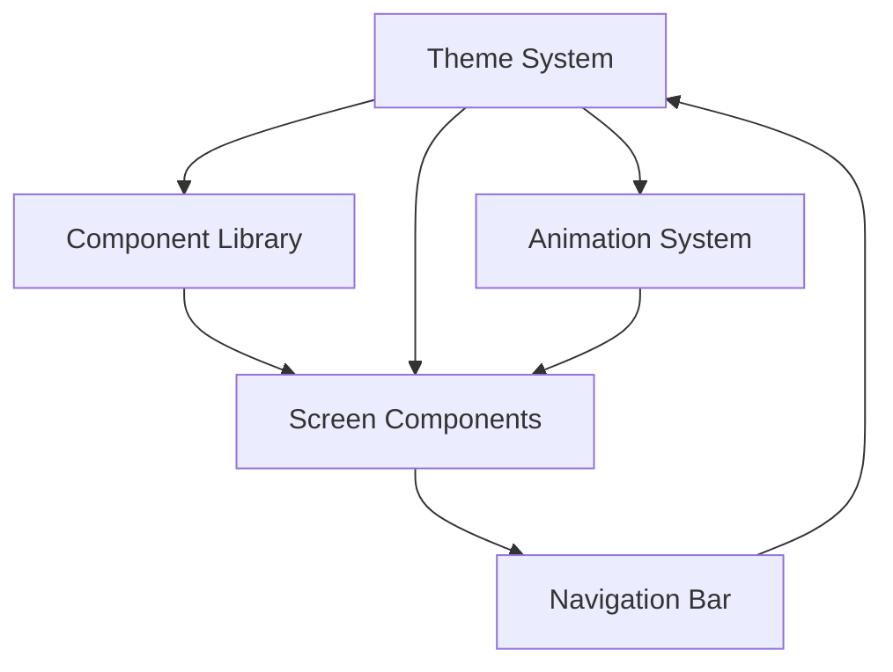

# Design Document: Unified Theme and UX

## Overview

This design document outlines the technical implementation for transforming the gig worker insurance mobile application from its current inconsistent theming (dark themes, violet gradients, varying visual treatments) to a unified, production-grade light theme with navy blue primary colors, orange accents, and polished micro-interactions.

The implementation will follow a phased approach:
1. **Theme System Enhancement**: Extend the existing `theme.ts` with comprehensive design tokens
2. **Component Library Creation**: Build reusable Card, Button, and Input components
3. **Screen-by-Screen Refactoring**: Systematically update all 10 screens to use the new theme
4. **Animation System**: Implement smooth transitions using React Native Animated API
5. **Navigation Bar Redesign**: Update the bottom tab bar to match the light theme
6. **Loading States**: Add skeleton screens and loading indicators

The design prioritizes maintainability through centralized theming, reusability through component abstraction, and performance through native driver animations.

## Architecture

### System Components



### Theme System Architecture

The theme system will be the single source of truth for all visual design decisions. It will be organized into logical sections:

- **Colors**: Primary, accent, semantic (success/warning/danger), text hierarchy, surfaces
- **Spacing**: Consistent spacing scale (xs, s, m, l, xl)
- **Typography**: Font sizes, weights, and line heights for all text styles
- **Border Radius**: Consistent corner radius values
- **Shadows**: Elevation system for cards and surfaces
- **Animation Timings**: Standard durations for transitions

### Component Hierarchy

```
App.tsx
├── Navigation Bar (Bottom Tabs)
└── Screen Components
    ├── Reusable Components
    │   ├── Card
    │   ├── Button
    │   ├── Input
    │   └── LoadingState
    └── Screen-Specific UI
```

### Data Flow

1. Theme tokens defined in `theme.ts`
2. Components import and consume theme tokens
3. Screens compose components with theme-aware styling
4. Animations use theme timing values
5. All color/spacing decisions reference theme system

## Components and Interfaces

### Enhanced Theme System

**File**: `src/theme.ts`

The theme system will be extended with the following structure:

```typescript
export const theme = {
  colors: {
    // Base colors
    background: '#F5F5F7',
    surface: '#FFFFFF',
    
    // Primary colors
    primary: '#1A1B4B',
    primaryLight: '#2D2E7A',
    primaryDark: '#0D0E2E',
    
    // Accent colors
    accent: '#E8472A',
    accentLight: '#FF6B4A',
    
    // Semantic colors
    success: '#2ECC71',
    successBg: '#E8F8F0',
    warning: '#F39C12',
    warningBg: '#FEF9E7',
    danger: '#E74C3C',
    dangerBg: '#FDEDEC',
    
    // Text hierarchy
    textMain: '#1A1B4B',
    textSub: '#4A4B6A',
    textMuted: '#9B9BB5',
    
    // Borders and dividers
    border: '#E8E8F0',
    
    // Shadows
    cardShadow: '#1A1B4B',
  },
  
  spacing: {
    xs: 4,
    s: 8,
    m: 16,
    l: 24,
    xl: 32,
  },
  
  borderRadius: {
    s: 8,
    m: 14,
    l: 20,
    xl: 28,
    round: 999,
  },
  
  typography: {
    header: { fontSize: 20, fontWeight: '800', color: '#1A1B4B' },
    title: { fontSize: 18, fontWeight: '700', color: '#1A1B4B' },
    subtitle: { fontSize: 14, fontWeight: '600' },
    body: { fontSize: 13, fontWeight: '400' },
    small: { fontSize: 11, fontWeight: '500' },
  },
  
  shadows: {
    card: {
      shadowColor: '#1A1B4B',
      shadowOffset: { width: 0, height: 4 },
      shadowOpacity: 0.06,
      shadowRadius: 12,
      elevation: 3,
    },
    cardHover: {
      shadowColor: '#1A1B4B',
      shadowOffset: { width: 0, height: 8 },
      shadowOpacity: 0.08,
      shadowRadius: 16,
      elevation: 6,
    },
  },
  
  animation: {
    fast: 200,
    normal: 300,
    slow: 400,
    fadeIn: 600,
  },
};
```

### Card Component

**File**: `src/components/Card.tsx`

A reusable card component that provides consistent styling across the app.

```typescript
interface CardProps {
  children: React.ReactNode;
  style?: ViewStyle;
  onPress?: () => void;
  variant?: 'default' | 'elevated' | 'outlined';
}

export const Card: React.FC<CardProps> = ({ 
  children, 
  style, 
  onPress,
  variant = 'default' 
}) => {
  // Implementation details in code section
};
```

**Variants**:
- `default`: White background with subtle shadow
- `elevated`: Increased shadow for emphasis
- `outlined`: Border instead of shadow for subtle separation

### Button Component

**File**: `src/components/Button.tsx`

A reusable button component with multiple variants and built-in animations.

```typescript
interface ButtonProps {
  title: string;
  onPress: () => void;
  variant?: 'primary' | 'secondary' | 'outline' | 'ghost';
  size?: 'small' | 'medium' | 'large';
  icon?: string;
  disabled?: boolean;
  loading?: boolean;
}

export const Button: React.FC<ButtonProps> = ({
  title,
  onPress,
  variant = 'primary',
  size = 'medium',
  icon,
  disabled = false,
  loading = false,
}) => {
  // Implementation details in code section
};
```

**Variants**:
- `primary`: Navy blue background with white text
- `secondary`: Orange accent background with white text
- `outline`: Transparent with navy border
- `ghost`: Transparent with navy text

### Input Component

**File**: `src/components/Input.tsx`

A reusable input field component with consistent styling and validation states.

```typescript
interface InputProps {
  value: string;
  onChangeText: (text: string) => void;
  placeholder?: string;
  label?: string;
  error?: string;
  icon?: string;
  secureTextEntry?: boolean;
  keyboardType?: KeyboardTypeOptions;
  autoCapitalize?: 'none' | 'sentences' | 'words' | 'characters';
}

export const Input: React.FC<InputProps> = ({
  value,
  onChangeText,
  placeholder,
  label,
  error,
  icon,
  secureTextEntry = false,
  keyboardType = 'default',
  autoCapitalize = 'none',
}) => {
  // Implementation details in code section
};
```

### LoadingState Component

**File**: `src/components/LoadingState.tsx`

A component for displaying loading indicators and skeleton screens.

```typescript
interface LoadingStateProps {
  variant?: 'spinner' | 'skeleton';
  skeletonType?: 'card' | 'list' | 'text';
  count?: number;
}

export const LoadingState: React.FC<LoadingStateProps> = ({
  variant = 'spinner',
  skeletonType = 'card',
  count = 3,
}) => {
  // Implementation details in code section
};
```

## Data Models

### Theme Token Structure

The theme system uses a hierarchical token structure:

```typescript
type ColorToken = string; // Hex color value
type SpacingToken = number; // Pixel value
type RadiusToken = number; // Pixel value
type AnimationToken = number; // Milliseconds

interface ThemeColors {
  background: ColorToken;
  surface: ColorToken;
  primary: ColorToken;
  primaryLight: ColorToken;
  primaryDark: ColorToken;
  accent: ColorToken;
  accentLight: ColorToken;
  success: ColorToken;
  successBg: ColorToken;
  warning: ColorToken;
  warningBg: ColorToken;
  danger: ColorToken;
  dangerBg: ColorToken;
  textMain: ColorToken;
  textSub: ColorToken;
  textMuted: ColorToken;
  border: ColorToken;
  cardShadow: ColorToken;
}

interface ThemeSpacing {
  xs: SpacingToken;
  s: SpacingToken;
  m: SpacingToken;
  l: SpacingToken;
  xl: SpacingToken;
}

interface ThemeBorderRadius {
  s: RadiusToken;
  m: RadiusToken;
  l: RadiusToken;
  xl: RadiusToken;
  round: RadiusToken;
}

interface TypographyStyle {
  fontSize: number;
  fontWeight: '400' | '500' | '600' | '700' | '800' | '900';
  color?: ColorToken;
}

interface ThemeTypography {
  header: TypographyStyle;
  title: TypographyStyle;
  subtitle: TypographyStyle;
  body: TypographyStyle;
  small: TypographyStyle;
}

interface ShadowStyle {
  shadowColor: ColorToken;
  shadowOffset: { width: number; height: number };
  shadowOpacity: number;
  shadowRadius: number;
  elevation: number;
}

interface ThemeShadows {
  card: ShadowStyle;
  cardHover: ShadowStyle;
}

interface ThemeAnimation {
  fast: AnimationToken;
  normal: AnimationToken;
  slow: AnimationToken;
  fadeIn: AnimationToken;
}

interface Theme {
  colors: ThemeColors;
  spacing: ThemeSpacing;
  borderRadius: ThemeBorderRadius;
  typography: ThemeTypography;
  shadows: ThemeShadows;
  animation: ThemeAnimation;
}
```

### Animation State Model

For managing animation states across components:

```typescript
interface AnimationState {
  fadeAnim: Animated.Value;
  slideAnim: Animated.Value;
  scaleAnim: Animated.Value;
}

interface AnimationConfig {
  duration: number;
  useNativeDriver: boolean;
  delay?: number;
}
```

## Screen Refactoring Strategy

### Phased Approach

The screen refactoring will follow this order to minimize risk and allow for iterative testing:

**Phase 1: Foundation Screens** (Low complexity, high visibility)
1. SignUpScreen
2. SignInScreen
3. OnboardingScreen

**Phase 2: Core Screens** (Medium complexity, critical functionality)
4. HomeScreen
5. ProfileScreen
6. PolicySelectionScreen

**Phase 3: Feature Screens** (Higher complexity, specialized functionality)
7. ClaimsScreen
8. AnalyticsScreen
9. LocationScreen
10. TermsScreen

### Screen Refactoring Pattern

Each screen will follow this refactoring pattern:

1. **Import Theme**: Replace hardcoded colors with theme tokens
2. **Replace Containers**: Update background colors to light theme
3. **Update Cards**: Use Card component or apply card styling
4. **Refactor Buttons**: Use Button component
5. **Refactor Inputs**: Use Input component (where applicable)
6. **Add Animations**: Implement fade-in and slide-up animations
7. **Update Typography**: Apply typography styles from theme
8. **Test Interactions**: Verify all touch targets and feedback

### HomeScreen Refactoring Example

**Current State**: Dark theme (#0D0B1E background), purple gradients, custom card styling

**Target State**: Light theme (#F5F5F7 background), navy blue primary, orange accents, Card components

**Key Changes**:
- Background: `#0D0B1E` → `#F5F5F7`
- Hero card: Purple gradient → Navy gradient with theme colors
- Trigger cards: Dark cards → White cards with colored left border
- Text colors: White/light → Navy/dark with proper hierarchy
- Icons: Light colors → Theme-based colors
- Animations: Add fade-in on mount

### ProfileScreen Refactoring Example

**Current State**: Dark theme, purple gradient hero, custom styling

**Target State**: Light theme, navy gradient hero, consistent card styling

**Key Changes**:
- Background: `#0D0B1E` → `#F5F5F7`
- Hero card: Purple gradient → Navy gradient
- Menu items: Dark cards → White cards
- Avatar: Purple → Orange accent
- Text: White → Navy with hierarchy
- Badges: Update colors to theme palette

### SignUpScreen Refactoring Example

**Current State**: Violet gradient header, custom input styling

**Target State**: Navy gradient header, Input components, consistent styling

**Key Changes**:
- Header gradient: Violet → Navy blue shades
- Form card: Maintain white but update shadows
- Inputs: Refactor to use Input component
- Button: Use Button component with primary variant
- Step indicator: Update colors to theme
- Focus states: Navy blue borders

## Navigation Bar Redesign

### Current Implementation

The bottom tab bar currently uses:
- Dark surface color
- Purple active state
- Custom icon rendering
- Inconsistent with light theme

### Target Design

```typescript
interface TabBarProps {
  current: Screen;
  onNavigate: (screen: string) => void;
}

const BottomTabBar: React.FC<TabBarProps> = ({ current, onNavigate }) => {
  const tabs = [
    { id: 'Home', label: 'Home', icon: Icon.home },
    { id: 'PolicySelection', label: 'Policy', icon: Icon.wallet },
    { id: 'Claims', label: 'Claims', icon: Icon.claims },
    { id: 'Analytics', label: 'Analytics', icon: Icon.analytics },
    { id: 'Profile', label: 'Profile', icon: Icon.person },
  ];
  
  // Implementation with light theme
};
```

**Styling Changes**:
- Background: Dark → White (#FFFFFF)
- Border: Dark → Light (#E8E8F0)
- Active icon container: Purple → Navy (#1A1B4B)
- Active label: Purple → Navy (#1A1B4B)
- Inactive icon/label: Light gray → Muted (#9B9BB5)
- Height: Maintain 80px for comfortable touch targets

## Animation System Implementation

### Animation Patterns

**1. Screen Mount Animation**

Every screen will implement a fade-in and slide-up animation on mount:

```typescript
const fadeAnim = useRef(new Animated.Value(0)).current;
const slideAnim = useRef(new Animated.Value(50)).current;

useEffect(() => {
  Animated.parallel([
    Animated.timing(fadeAnim, {
      toValue: 1,
      duration: theme.animation.fadeIn,
      useNativeDriver: true,
    }),
    Animated.spring(slideAnim, {
      toValue: 0,
      tension: 50,
      friction: 8,
      useNativeDriver: true,
    }),
  ]).start();
}, []);
```

**2. Button Press Animation**

Buttons will scale down slightly on press:

```typescript
const scaleAnim = useRef(new Animated.Value(1)).current;

const handlePressIn = () => {
  Animated.spring(scaleAnim, {
    toValue: 0.96,
    tension: 300,
    friction: 10,
    useNativeDriver: true,
  }).start();
};

const handlePressOut = () => {
  Animated.spring(scaleAnim, {
    toValue: 1,
    tension: 300,
    friction: 10,
    useNativeDriver: true,
  }).start();
};
```

**3. Card Press Animation**

Cards with onPress will have subtle scale animation:

```typescript
const scaleAnim = useRef(new Animated.Value(1)).current;

const animatedStyle = {
  transform: [{ scale: scaleAnim }],
};

// Scale to 0.98 on press
```

**4. Loading State Animation**

Skeleton screens will pulse:

```typescript
const pulseAnim = useRef(new Animated.Value(0.3)).current;

useEffect(() => {
  Animated.loop(
    Animated.sequence([
      Animated.timing(pulseAnim, {
        toValue: 1,
        duration: 1000,
        useNativeDriver: true,
      }),
      Animated.timing(pulseAnim, {
        toValue: 0.3,
        duration: 1000,
        useNativeDriver: true,
      }),
    ])
  ).start();
}, []);
```

**5. Input Focus Animation**

Input fields will animate border color and scale on focus:

```typescript
const borderAnim = useRef(new Animated.Value(0)).current;

const handleFocus = () => {
  Animated.timing(borderAnim, {
    toValue: 1,
    duration: theme.animation.normal,
    useNativeDriver: false,
  }).start();
};

const borderColor = borderAnim.interpolate({
  inputRange: [0, 1],
  outputRange: [theme.colors.border, theme.colors.primary],
});
```

### Animation Performance Optimization

- Use `useNativeDriver: true` for transform and opacity animations
- Avoid animating layout properties (width, height, padding) when possible
- Use `Animated.Value` instead of state for animation values
- Implement `shouldComponentUpdate` or `React.memo` for animated components
- Batch animations with `Animated.parallel` when appropriate

## Loading States and Skeleton Screens

### Loading State Strategy

**Spinner Loading**: For quick operations (< 2 seconds)
- Use ActivityIndicator with primary color
- Center in container
- Optional loading text

**Skeleton Loading**: For longer operations or list content
- Mimic the structure of actual content
- Animated pulse effect
- Gray placeholder elements

### Skeleton Screen Patterns

**Card Skeleton**:
```
┌─────────────────────────┐
│ ████████████            │  <- Title placeholder
│ ████████                │  <- Subtitle placeholder
│                         │
│ ████████████████████    │  <- Content placeholder
│ ████████████            │
└─────────────────────────┘
```

**List Skeleton**:
```
┌─────────────────────────┐
│ ⬤  ████████████         │  <- List item 1
├─────────────────────────┤
│ ⬤  ████████████         │  <- List item 2
├─────────────────────────┤
│ ⬤  ████████████         │  <- List item 3
└─────────────────────────┘
```

### Implementation

```typescript
const SkeletonCard: React.FC = () => {
  const pulseAnim = useRef(new Animated.Value(0.3)).current;
  
  useEffect(() => {
    Animated.loop(
      Animated.sequence([
        Animated.timing(pulseAnim, { toValue: 1, duration: 1000, useNativeDriver: true }),
        Animated.timing(pulseAnim, { toValue: 0.3, duration: 1000, useNativeDriver: true }),
      ])
    ).start();
  }, []);
  
  return (
    <View style={styles.skeletonCard}>
      <Animated.View style={[styles.skeletonTitle, { opacity: pulseAnim }]} />
      <Animated.View style={[styles.skeletonSubtitle, { opacity: pulseAnim }]} />
      <Animated.View style={[styles.skeletonContent, { opacity: pulseAnim }]} />
    </View>
  );
};
```


## Correctness Properties

*A property is a characteristic or behavior that should hold true across all valid executions of a system—essentially, a formal statement about what the system should do. Properties serve as the bridge between human-readable specifications and machine-verifiable correctness guarantees.*

### Property Reflection

After analyzing all acceptance criteria, the following redundancies were identified and consolidated:

- **Screen background colors** (2.1-2.10): All screens follow the same pattern, consolidated into Property 2
- **Typography definitions** (4.1-4.5): All are configuration checks, consolidated into examples
- **Navigation bar styling** (6.1-6.6): All are specific styling checks, consolidated into examples
- **Animation configuration** (5.5 and 11.3): Duplicate requirement, kept as Property 5
- **Input field styling** (12.1-12.3, 12.6): Specific styling checks, consolidated into examples
- **Card shadow properties** (3.3, 3.6): Related shadow requirements, consolidated into Property 3

### Property 1: Theme Color Consistency

*For any* screen component in the application, all color values used in styles should reference `theme.colors` rather than hardcoded hex values.

**Validates: Requirements 1.5**

### Property 2: Screen Background Theme Compliance

*For any* screen component, the background color should be the light theme background color from `theme.colors.background`.

**Validates: Requirements 2.1, 2.2, 2.3, 2.4, 2.5, 2.6, 2.7, 2.8, 2.9, 2.10**

### Property 3: Card Border Radius Range

*For any* Card component instance, the border radius value should be between 14 and 24 pixels inclusive.

**Validates: Requirements 3.2**

### Property 4: Card Shadow Configuration

*For any* Card component, the shadow should have shadowColor set to theme.colors.cardShadow, shadowOpacity between 0.04 and 0.08, and shadowRadius defined.

**Validates: Requirements 3.3, 3.6**

### Property 5: Card Spacing Consistency

*For any* screen displaying multiple Card components, the spacing between consecutive cards should be between 12 and 16 pixels.

**Validates: Requirements 3.5**

### Property 6: Card Padding Range

*For any* Card component, the padding should be between 16 and 24 pixels based on content density.

**Validates: Requirements 3.4**

### Property 7: Typography Theme Compliance

*For any* text element in a screen component, the text style should reference a style from `theme.typography` rather than using inline font size and weight values.

**Validates: Requirements 4.6**

### Property 8: Screen Mount Fade Animation

*For any* screen component, when it mounts, it should animate content with a fade-in effect using Animated.timing with duration between 400 and 700 milliseconds.

**Validates: Requirements 5.1**

### Property 9: Screen Mount Slide Animation

*For any* screen component, when it mounts, it should animate content with a slide-up effect using either Animated.spring or Animated.timing.

**Validates: Requirements 5.2**

### Property 10: Button Press Scale Animation

*For any* button component, when pressed, it should animate with a scale transform from 1.0 to 0.96 using Animated.spring.

**Validates: Requirements 5.3**

### Property 11: Card Press Scale Animation

*For any* pressable card component, when pressed, it should animate with a scale transform from 1.0 to 0.98 using Animated.spring.

**Validates: Requirements 5.4**

### Property 12: Native Driver for Transform Animations

*For any* animation using transform or opacity properties, the animation configuration should have `useNativeDriver: true`.

**Validates: Requirements 5.5, 11.3**

### Property 13: Animation Value Restoration

*For any* animation, after completion, the animated values should return to their original state smoothly.

**Validates: Requirements 5.6**

### Property 14: Loading State Indicator Color

*For any* screen component that displays a loading state with ActivityIndicator, the indicator color should be `theme.colors.primary`.

**Validates: Requirements 7.1**

### Property 15: Skeleton Screen for List Content

*For any* screen component that displays list content, when data is loading, it should display a Skeleton_Screen with animated placeholder cards.

**Validates: Requirements 7.2**

### Property 16: Skeleton Screen Pulse Animation

*For any* Skeleton_Screen component, it should animate with a pulse effect using Animated.loop and Animated.sequence.

**Validates: Requirements 7.4**

### Property 17: Loading to Content Transition

*For any* screen component, when data loading completes, it should fade out the Loading_State and fade in actual content with duration of 300 milliseconds.

**Validates: Requirements 7.5**

### Property 18: Button Visual Feedback

*For any* button component, when pressed, it should provide visual feedback with either opacity change to 0.7 or scale animation.

**Validates: Requirements 8.1**

### Property 19: TouchableOpacity Active Opacity Range

*For any* TouchableOpacity component, the activeOpacity value should be between 0.6 and 0.85 inclusive.

**Validates: Requirements 8.2**

### Property 20: Swipe Gesture Visual Feedback

*For any* swipe gesture handler, when a swipe is performed, it should provide visual feedback with transform animation.

**Validates: Requirements 8.4**

### Property 21: Toggle Animation Duration

*For any* toggle or switch component, when state changes, it should animate the state change with duration between 200 and 300 milliseconds.

**Validates: Requirements 8.5**

### Property 22: Emphasis Gradient Colors

*For any* gradient used for emphasis, the gradient colors should use navy blue shades from `theme.colors.primary` to `theme.colors.primaryLight`.

**Validates: Requirements 9.1**

### Property 23: CTA Gradient Colors

*For any* gradient used for CTAs, the gradient colors should use orange shades from `theme.colors.accent` to `theme.colors.accentLight`.

**Validates: Requirements 9.2**

### Property 24: Gradient Configuration

*For any* LinearGradient component, it should have both start and end points defined for consistent direction.

**Validates: Requirements 9.3**

### Property 25: Gradient Button Text Color

*For any* button with a gradient background, the text color should be white (#FFFFFF) for readability.

**Validates: Requirements 9.4**

### Property 26: Interactive Element Touch Target Size

*For any* interactive element (button, touchable, input), the touch target size should be at least 44x44 points.

**Validates: Requirements 10.1**

### Property 27: Button Minimum Height

*For any* button component, the height should be at least 48 pixels.

**Validates: Requirements 10.2**

### Property 28: Text Minimum Font Size

*For any* text element, the font size should be at least 11 pixels for readability.

**Validates: Requirements 10.3**

### Property 29: Text Color Contrast Ratio

*For any* text element, the color contrast ratio between text and background should meet WCAG AA standards (minimum 4.5:1 for normal text).

**Validates: Requirements 10.4**

### Property 30: Icon Button Accessibility Label

*For any* icon-only button, it should have an accessible label defined for screen readers.

**Validates: Requirements 10.5**

### Property 31: Input Debouncing

*For any* input field that handles rapid user input, the input handler should debounce with a delay between 300 and 500 milliseconds.

**Validates: Requirements 11.5**

### Property 32: Input Field Border Radius Range

*For any* input field component, the border radius should be between 12 and 14 pixels.

**Validates: Requirements 12.4**

### Property 33: Input Field Height Range

*For any* input field component, the height should be between 48 and 56 pixels for comfortable interaction.

**Validates: Requirements 12.5**

## Error Handling

### Theme System Errors

**Missing Theme Token**
- **Scenario**: Component attempts to access undefined theme token
- **Handling**: Provide fallback values and log warning in development
- **Recovery**: Use default theme values from theme.ts

**Invalid Color Format**
- **Scenario**: Theme color value is not a valid hex color
- **Handling**: Validate color format on theme initialization
- **Recovery**: Use fallback color and log error

### Animation Errors

**Animation Interruption**
- **Scenario**: User navigates away before animation completes
- **Handling**: Clean up animation listeners in useEffect cleanup
- **Recovery**: Stop animation and reset values

**Native Driver Incompatibility**
- **Scenario**: Animation property not supported by native driver
- **Handling**: Detect and fall back to JS driver with warning
- **Recovery**: Continue animation with JS driver

### Component Errors

**Missing Required Props**
- **Scenario**: Component rendered without required props
- **Handling**: Use TypeScript to enforce required props at compile time
- **Recovery**: Provide sensible defaults where possible

**Invalid Variant**
- **Scenario**: Component receives invalid variant prop
- **Handling**: Validate variant and fall back to default
- **Recovery**: Use default variant and log warning

### Loading State Errors

**Loading Timeout**
- **Scenario**: Data fetch takes longer than expected
- **Handling**: Implement timeout with error state
- **Recovery**: Show error message with retry option

**Skeleton Screen Mismatch**
- **Scenario**: Skeleton structure doesn't match actual content
- **Handling**: Design skeleton to match most common content structure
- **Recovery**: Fade transition masks minor mismatches

### Accessibility Errors

**Insufficient Contrast**
- **Scenario**: Text/background combination fails contrast check
- **Handling**: Validate contrast ratios during development
- **Recovery**: Adjust colors to meet WCAG AA standards

**Missing Accessibility Labels**
- **Scenario**: Interactive element lacks accessible label
- **Handling**: Lint rules to catch missing labels
- **Recovery**: Add descriptive labels to all interactive elements

## Testing Strategy

### Dual Testing Approach

This feature will use both unit tests and property-based tests to ensure comprehensive coverage:

**Unit Tests**: Verify specific examples, edge cases, and error conditions
- Theme configuration values
- Component rendering with specific props
- Navigation bar active/inactive states
- Input field focus/error states
- Specific screen background colors

**Property Tests**: Verify universal properties across all inputs
- Theme consistency across all screens
- Animation configurations
- Touch target sizes
- Color contrast ratios
- Component prop validation

Together, unit tests catch concrete bugs in specific scenarios, while property tests verify general correctness across the entire input space.

### Property-Based Testing Configuration

**Library**: We will use `fast-check` for TypeScript/JavaScript property-based testing

**Configuration**:
- Minimum 100 iterations per property test
- Each test tagged with reference to design document property
- Tag format: `Feature: unified-theme-and-ux, Property {number}: {property_text}`

**Example Property Test Structure**:

```typescript
import fc from 'fast-check';

describe('Feature: unified-theme-and-ux, Property 1: Theme Color Consistency', () => {
  it('should use theme colors instead of hardcoded values in all screens', () => {
    fc.assert(
      fc.property(
        fc.constantFrom(...ALL_SCREEN_COMPONENTS),
        (ScreenComponent) => {
          const styles = extractStyles(ScreenComponent);
          const hardcodedColors = findHardcodedColors(styles);
          return hardcodedColors.length === 0;
        }
      ),
      { numRuns: 100 }
    );
  });
});
```

### Unit Testing Strategy

**Theme System Tests**:
- Verify all color tokens are defined
- Verify spacing scale is correct
- Verify typography styles are defined
- Verify shadow configurations are correct

**Component Tests**:
- Card component renders with correct styling
- Button component handles all variants
- Input component handles focus/error states
- LoadingState component shows correct indicators

**Screen Tests**:
- Each screen uses light background
- Each screen imports theme
- Each screen has mount animations
- Each screen uses Card/Button/Input components

**Animation Tests**:
- Fade-in animation completes correctly
- Scale animation responds to press
- Skeleton pulse animation loops
- Native driver is used for transform/opacity

**Accessibility Tests**:
- Touch targets meet minimum size
- Text meets minimum font size
- Color contrast meets WCAG AA
- Icon buttons have labels

### Integration Testing

**Screen Navigation Flow**:
- Navigate between all screens
- Verify animations play smoothly
- Verify theme consistency maintained
- Verify no visual glitches

**Loading State Flow**:
- Trigger loading state
- Verify skeleton screens appear
- Verify transition to content
- Verify no layout shift

**User Interaction Flow**:
- Press buttons and verify feedback
- Focus inputs and verify styling
- Swipe gestures and verify feedback
- Toggle switches and verify animation

### Visual Regression Testing

**Snapshot Tests**:
- Capture screenshots of all screens
- Compare against baseline
- Flag any visual changes
- Review and approve changes

**Component Snapshots**:
- Card component variants
- Button component variants
- Input component states
- Loading state variants

### Performance Testing

**Animation Performance**:
- Measure frame rate during animations
- Verify 60fps target is met
- Profile animation overhead
- Optimize if needed

**Render Performance**:
- Measure screen mount time
- Verify no unnecessary re-renders
- Profile component render time
- Optimize heavy components

### Manual Testing Checklist

**Visual Consistency**:
- [ ] All screens use light theme
- [ ] Colors match design tokens
- [ ] Spacing is consistent
- [ ] Typography is consistent
- [ ] Shadows are subtle and consistent

**Animations**:
- [ ] Screen transitions are smooth
- [ ] Button press feedback is responsive
- [ ] Loading states animate correctly
- [ ] No animation jank or stuttering

**Accessibility**:
- [ ] Touch targets are comfortable
- [ ] Text is readable
- [ ] Color contrast is sufficient
- [ ] Screen reader labels are present

**Cross-Platform**:
- [ ] iOS rendering is correct
- [ ] Android rendering is correct
- [ ] Web rendering is correct (if applicable)
- [ ] No platform-specific issues

## Implementation Plan

### Phase 1: Foundation (Week 1)

**Tasks**:
1. Extend theme.ts with complete design tokens
2. Create Card component with variants
3. Create Button component with variants
4. Create Input component with states
5. Create LoadingState component with skeleton screens
6. Write unit tests for all components
7. Write property tests for theme consistency

**Deliverables**:
- Enhanced theme system
- Reusable component library
- Component test suite

### Phase 2: Core Screens (Week 2)

**Tasks**:
1. Refactor SignUpScreen to use new theme and components
2. Refactor SignInScreen to use new theme and components
3. Refactor OnboardingScreen to use new theme and components
4. Refactor HomeScreen to use new theme and components
5. Refactor ProfileScreen to use new theme and components
6. Update navigation bar to light theme
7. Write screen-specific tests

**Deliverables**:
- 5 refactored screens
- Updated navigation bar
- Screen test suite

### Phase 3: Feature Screens (Week 3)

**Tasks**:
1. Refactor PolicySelectionScreen
2. Refactor ClaimsScreen
3. Refactor AnalyticsScreen
4. Refactor LocationScreen
5. Refactor TermsScreen
6. Add loading states to all screens
7. Write integration tests

**Deliverables**:
- All 10 screens refactored
- Loading states implemented
- Integration test suite

### Phase 4: Polish and Testing (Week 4)

**Tasks**:
1. Add animations to all screens
2. Implement skeleton screens
3. Add micro-interactions
4. Accessibility audit and fixes
5. Performance optimization
6. Visual regression testing
7. Manual testing across devices

**Deliverables**:
- Polished animations
- Accessibility compliance
- Performance benchmarks
- Test coverage report

## Migration Strategy

### Backward Compatibility

During the migration, we will maintain backward compatibility:

1. **Theme Aliases**: Keep old theme color names as aliases
2. **Gradual Migration**: Migrate screens one at a time
3. **Feature Flags**: Use flags to toggle new theme per screen
4. **Rollback Plan**: Keep old screen implementations for quick rollback

### Rollout Plan

**Week 1**: Internal testing with new theme on SignUpScreen only
**Week 2**: Beta testing with 10% of users on core screens
**Week 3**: Expand to 50% of users with all screens
**Week 4**: Full rollout to 100% of users

### Monitoring

**Metrics to Track**:
- Screen load times
- Animation frame rates
- User engagement metrics
- Crash rates
- User feedback

**Success Criteria**:
- No increase in crash rates
- Maintain or improve screen load times
- Positive user feedback
- Consistent 60fps animations

## Conclusion

This design provides a comprehensive blueprint for implementing a unified theme and production-grade UX across the gig worker insurance mobile application. The phased approach minimizes risk while the dual testing strategy ensures correctness. The reusable component library will improve maintainability and consistency going forward.

Key success factors:
- Centralized theme system as single source of truth
- Reusable component library for consistency
- Property-based testing for comprehensive coverage
- Phased rollout with monitoring
- Accessibility compliance throughout
