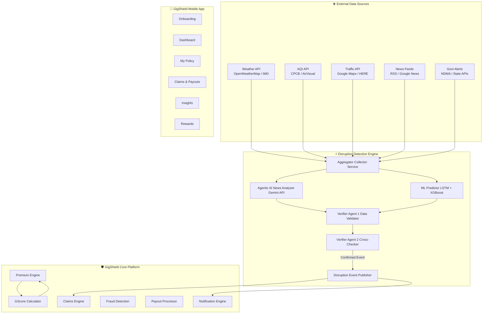
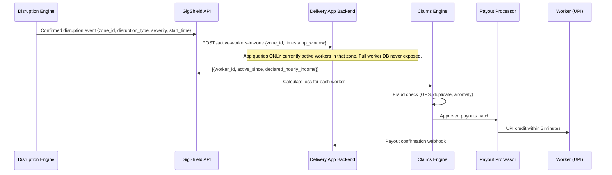
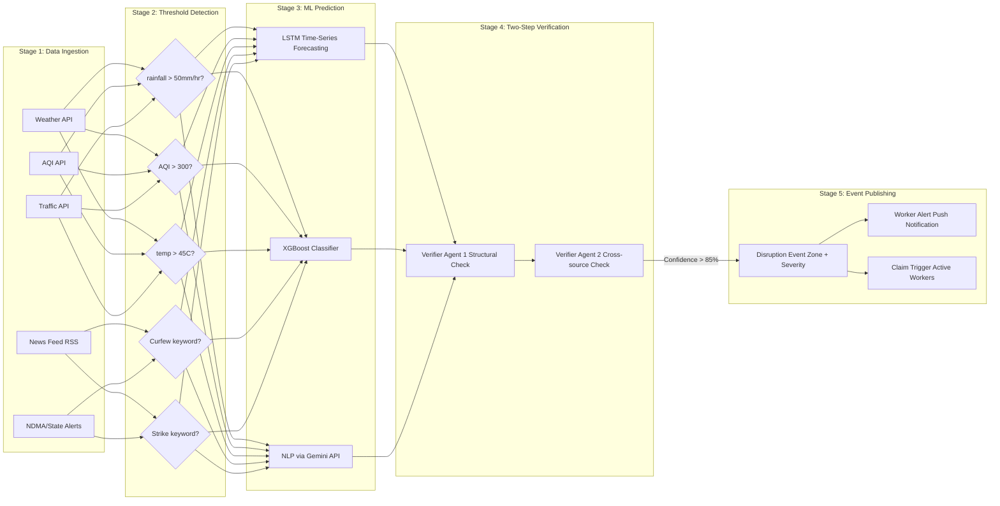
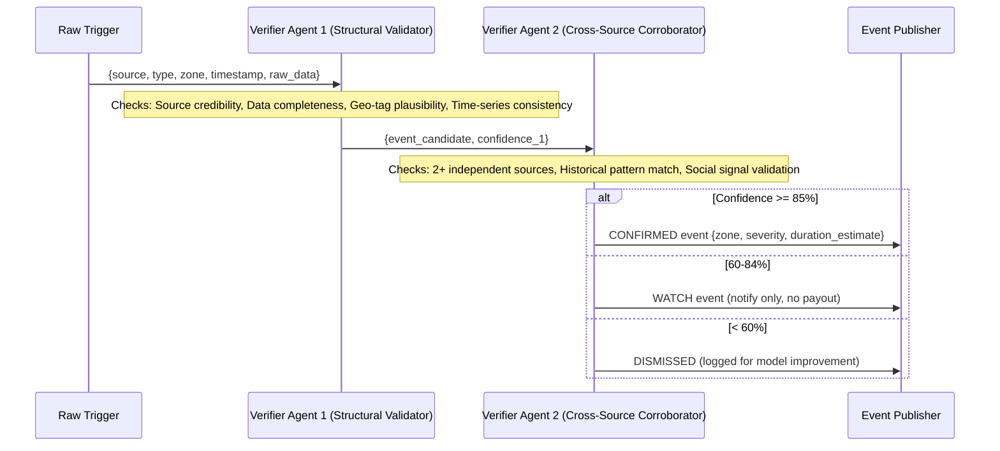
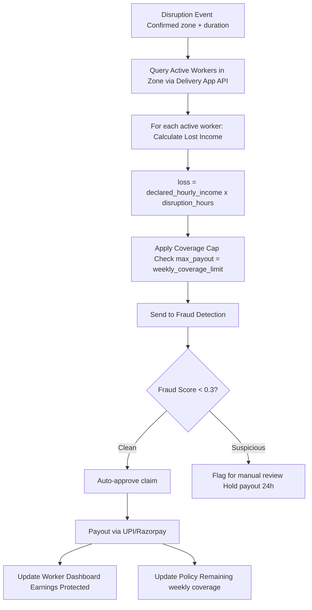
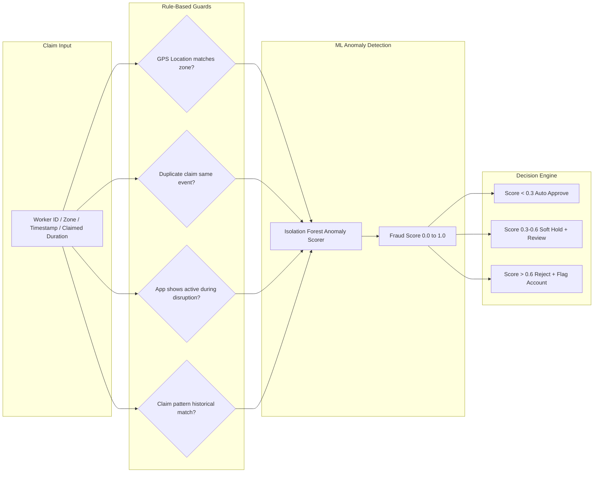
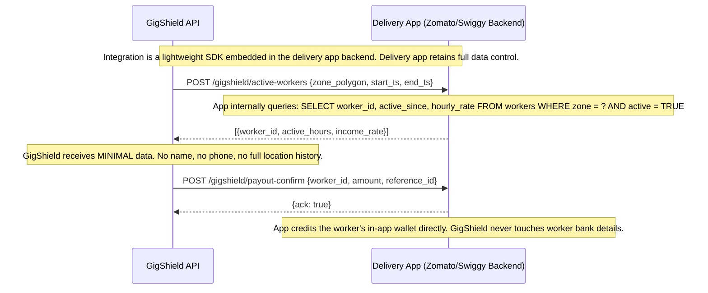
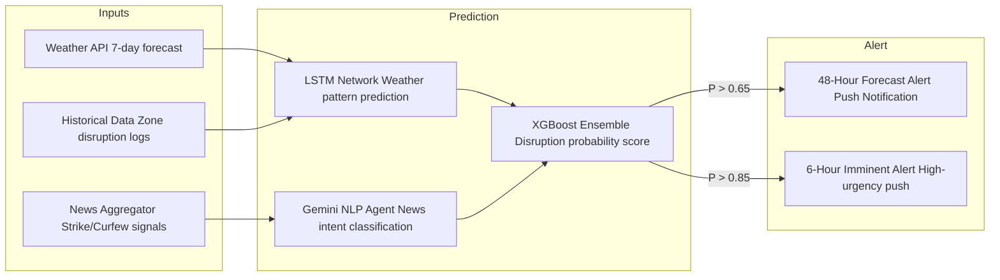
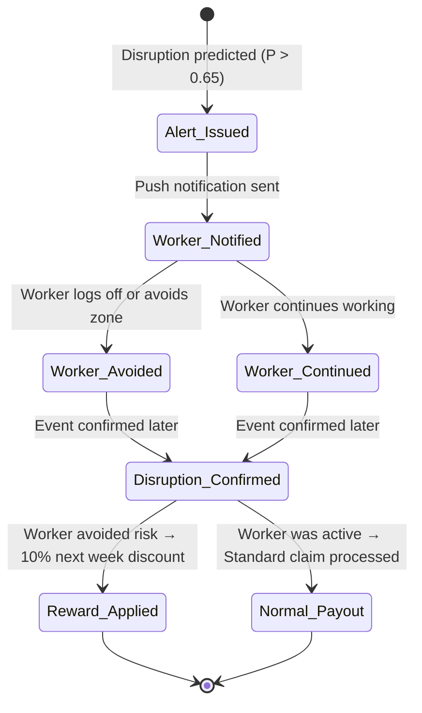
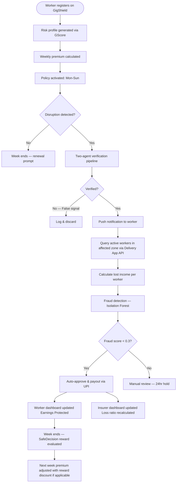

<div align="center">

# 🛡️ GigShield

### AI-Powered Parametric Income Insurance for India's Gig Economy

[](https://devtrails.guidewire.com)
[]()
[]()
[](https://reactnative.dev)
[](https://nodejs.org)
[](https://ai.google.dev)

**Protecting the last-mile heroes of India's digital economy**

*Built with ❤️ for India's 5 million delivery warriors*

</div>

---

## 📋 Table of Contents

1. [Problem Statement](#1-problem-statement)
2. [Our Solution — GigShield](#2-our-solution--gigshield)
3. [Persona Focus](#3-persona-focus)
4. [System Architecture](#4-system-architecture)
5. [Core Modules & Algorithms](#5-core-modules--algorithms)
6. [Key Innovation: Privacy-First API Integration](#6-key-innovation-privacy-first-api-integration)
7. [Predictive Alert & Reward System](#7-predictive-alert--reward-system)
8. [Application Pages & User Experience](#8-application-pages--user-experience)
9. [Tech Stack](#9-tech-stack)
10. [Platform Strategy](#10-platform-strategy--mobile-app--embedded-sdk)
11. [Weekly Pricing Model](#11-weekly-pricing-model)
12. [Data Flow Diagrams](#12-data-flow-diagrams)
13. [Research References](#13-research-references)
14. [Phase 1 Deliverables Checklist](#14-phase-1-deliverables-checklist)

---

## 1. Problem Statement

India's platform-based delivery partners — working for **Zomato, Swiggy, Zepto, Amazon, Dunzo, and Blinkit** — form the backbone of the country's ₹2.5 lakh crore quick-commerce ecosystem. Yet they are among its most economically vulnerable participants.

External disruptions can erase **20–30% of their monthly income**:

| Disruption Type | Examples | Worker Impact |
|---|---|---|
| **Environmental** | Heavy rain (>50mm), Floods, Extreme heat (>45°C), Severe AQI (>300) | Cannot work outdoors / Deliveries halted |
| **Social** | Unplanned curfews, Local strikes, Sudden market/zone closures | Unable to access pickup/drop locations |

### What does NOT exist today:
- ❌ No income safety net for disruption-caused downtime
- ❌ No automated, real-time claim mechanism
- ❌ No platform that distinguishes between "worker was idle" vs "worker couldn't work"

### Explicitly OUT of scope:
> ❌ Health insurance &nbsp;|&nbsp; ❌ Life insurance &nbsp;|&nbsp; ❌ Accident coverage &nbsp;|&nbsp; ❌ Vehicle repair &nbsp;|&nbsp; ❌ Medical costs

---

## 2. Our Solution — GigShield

GigShield is a **lightweight, AI-powered parametric income insurance platform** that:

| Capability | Description |
|---|---|
| 🔍 **Detects** | Disruption events automatically using weather APIs, AQI feeds, traffic APIs, and an AI news aggregation agent |
| ✅ **Verifies** | Events through a two-stage agentic AI pipeline before triggering payouts |
| 💰 **Calculates** | Payout based on the worker's actual lost hours and declared income |
| 📲 **Pays** | Instantly via simulated UPI/Razorpay within minutes of event confirmation |
| 🎁 **Rewards** | Workers who act on disruption alerts, creating a proactive safety culture |
| 🔌 **Integrates** | With existing delivery apps as a lightweight backend API — without exposing the full worker database |

> We don't just insure disruptions — **we predict them, warn workers, and reward smart decisions.**

---

## 3. Persona Focus

### Primary Persona: Food Delivery Partners

| Attribute | Detail |
|---|---|
| **Platforms** | Zomato, Swiggy |
| **Work Pattern** | 6–14 hours/day, primarily two-wheelers, rain-exposed, urban/semi-urban zones |
| **Avg. Earnings** | ₹600–₹1,200/day depending on city tier and order density |
| **Vulnerability** | Highest exposure to rain, heat, and flood disruptions; zone-locked by platform |

**Why Food Delivery first?**
- Largest segment (~5M+ active delivery workers in India)
- Highest climate vulnerability due to outdoor, two-wheeler-dependent work
- Partner platforms (Zomato/Swiggy) already have active-worker location APIs feasible for integration

---

## 4. System Architecture

### 4.1 High-Level Architecture Diagram



### 4.2 Data Privacy Architecture (Zone-Based Active Worker Query)



---

## 5. Core Modules & Algorithms

### 5.1 GScore — Worker Risk Profiling

The **GScore** is a composite performance metric reflecting a delivery worker's reliability, efficiency, and resilience. Used for both risk profiling (premium adjustment) and fraud detection (claim credibility).

> 📚 **Academic Reference:** Gohil, J. & Jha, A. (2024). *Addressing Policy Gaps for Gig Workers in India.* IJFMR, Vol. 6, Issue 6. E-ISSN: 2582-2160.

#### GScore Formula

```
GScore = (W1 × Time) + (W2 × Orders) + (W3 × BeforeTime)
       + (W4 × BadWeather) + (W5 × Distance) + (W6 × TimeOfDay)
```

Each parameter is normalized to [0, 1]:

| Parameter | Weight | Description |
|---|---|---|
| Time | W1 = 0.15 | Time efficiency per delivery |
| Orders | W2 = 0.20 | Daily order volume |
| BeforeTime | W3 = 0.15 | On-time delivery rate |
| BadWeather | W4 = 0.15 | Resilience — orders during adverse conditions |
| Distance | W5 = 0.20 | Average distance coverage |
| TimeOfDay | W6 = 0.15 | Deliveries during challenging slots |

#### Interpretation Scale

| GScore Range | Worker Tier | Premium Modifier |
|---|---|---|
| 0.75 – 1.00 | 🏆 Elite Worker | −15% premium discount |
| 0.50 – 0.74 | ✅ Reliable Worker | −5% premium discount |
| 0.30 – 0.49 | 📋 Standard Worker | Base premium |
| 0.00 – 0.29 | ⚠️ At-Risk Worker | +10% loading (manual review) |

#### Example Calculations

**High-performing worker (Bangalore, experienced Swiggy partner):**
```
GScore = (0.15×0.8) + (0.20×0.9) + (0.15×0.8) + (0.15×0.9) + (0.20×0.8) + (0.15×0.9)
       = 0.12 + 0.18 + 0.12 + 0.135 + 0.16 + 0.135
       = 0.85  → Elite Worker → −15% on premium
```

**New / low-frequency worker:**
```
GScore = (0.15×0.4) + (0.20×0.2) + (0.15×0.3) + (0.15×0.1) + (0.20×0.2) + (0.15×0.1)
       = 0.06 + 0.04 + 0.045 + 0.015 + 0.04 + 0.015
       = 0.215  → At-Risk Worker → +10% loading
```

---

### 5.2 Dynamic Premium Calculation

Weekly premium is dynamically calculated per worker using a risk scoring model incorporating geo-temporal factors.

#### Premium Formula

```
Weekly Premium = Base_Premium × Zone_Risk_Multiplier × Season_Factor × GScore_Modifier

Zone_Risk_Multiplier = normalize(
    0.40 × weather_risk_score(zone, week)
  + 0.25 × flood_zone_index(pincode)
  + 0.20 × pollution_index_7day_avg(city)
  + 0.15 × strike_history_score(zone, month)
)

Season_Factor    = historical_disruption_freq(zone, current_month) / annual_avg
GScore_Modifier  = 1 - ((GScore - 0.5) × 0.3)   // ranges from 0.85 to 1.15
```

#### Practical Example — Chennai worker, December

| Factor | Value |
|---|---|
| Base premium | ₹35/week |
| Zone risk multiplier | 1.45 (high — cyclone season) |
| Season factor | 1.60 (December = 3× historical disruptions) |
| GScore modifier | 0.88 (experienced, reliable worker) |
| **Final premium** | **₹35 × 1.45 × 1.60 × 0.88 ≈ ₹71/week** |

> **Algorithm:** Gradient Boosted Trees (XGBoost) trained on 3-year historical disruption data per pin code, with online learning to update risk weights monthly.

---

### 5.3 Disruption Detection Pipeline



#### Trigger Thresholds

| Event | Trigger Condition | Severity |
|---|---|---|
| Heavy Rain | Rainfall > 50mm/hr | 🔴 HIGH |
| Extreme Heat | Temperature > 45°C, Heat Index > 52°C | 🔴 HIGH |
| Flood | IMD Red Alert + waterlogging reports | 🚨 CRITICAL |
| Severe Pollution | AQI > 300 (Hazardous) | 🟠 MEDIUM |
| Curfew | NLP detection + Govt API confirmation | 🚨 CRITICAL |
| Strike | NLP detection (2+ corroborating sources) | 🔴 HIGH |
| Market Closure | Zone-specific NLP + traffic API corroboration | 🟠 MEDIUM |

---

### 5.4 Two-Step Event Verification (Agentic AI)

To ensure payouts are triggered only for genuine disruptions, we implement a **dual-agent verification pipeline** powered by Gemini API.



**Why Two-Step?**
- Prevents false payouts from single-source API errors or data spikes
- Adds corroboration between structural validation (Agent 1) and contextual verification (Agent 2)
- Each agent uses a separate Gemini API prompt chain with different context windows

---

### 5.5 Parametric Claim Engine



#### Claim Calculation Example

```
Worker:          Rahul (Swiggy, Chennai)
Declared income: ₹900/day → ₹90/hr
Working hours:   10 hrs/day
Disruption:      Heavy rain, 6 hours, Zone: T-Nagar

Lost Income  = ₹90 × 6 = ₹540
Coverage cap = ₹540 < weekly cap (₹3,500) ✓
Fraud score  = 0.12 (clean)
Payout       = ₹540 credited via UPI in ~4 minutes ✅
```

---

### 5.6 Fraud Detection System

Multi-layer anomaly detection using **Isolation Forest + Rule-based Guards**:



#### Fraud Signals Monitored

| Signal | Detection Method |
|---|---|
| GPS spoofing | Cross-check GPS with delivery app's last-known location |
| Fake zone presence | App confirms worker was NOT active in claimed zone |
| Duplicate claims | Worker claiming same event on multiple policies |
| Claim while working | App data shows deliveries made during claimed disruption window |
| Unusual claim frequency | Isolation Forest detects statistical outlier vs peer group |
| Account farming | Multiple policies registered to same device fingerprint |

---

## 6. Key Innovation: Privacy-First API Integration

### The Problem with Naive Approaches

A conventional approach would share the full worker database with the insurer. This violates data privacy, creates compliance risk, and exposes the delivery platform to unnecessary liability.

### GigShield's Zone-Based Active Query Model



### SDK Design Principles

| Principle | Detail |
|---|---|
| 🪶 **Lightweight** | <200KB footprint, designed for low-memory Android devices |
| 🔒 **Stateless** | Each API call is independent; no persistent session data stored on device |
| 🛡️ **Privacy-first** | Delivery app never sends PII (name, phone, bank details) to GigShield |
| 📶 **Low-network tolerant** | Queue-based retry mechanism for 2G/3G environments |
| 📱 **Works standalone** | GigShield's own mobile app for workers not on partner platforms |

---

## 7. Predictive Alert & Reward System

### Disaster Prediction Engine



### Reward & Discount System — "SafeDecision Rewards"

When GigShield predicts a disruption and a worker acts on the alert (avoids the zone or logs off), they earn a **SafeDecision badge** and receive a discount on the following week's premium.



### Reward Tiers

| Consecutive Safe Decisions | Discount | Badge |
|---|---|---|
| 1 SafeDecision | −5% | 🌧️ Rain-Ready |
| 3 Consecutive | −10% | ⚡ Storm Shield |
| 5 Consecutive | −15% | 🏆 Safety Champion |
| 10 Lifetime | −20% permanent tier | 🦺 GigGuardian |

---

## 8. Application Pages & User Experience

### Page 1 — Onboarding / Registration
- Worker selects delivery platform (Zomato / Swiggy / Zepto etc.)
- Enters city and zone (pincode-based)
- Declares average daily earnings and typical working hours
- System auto-generates a risk profile using GScore
- Displays a preview of weekly premium before commitment

### Page 2 — Worker Dashboard

The central hub. Displays:
- 🟢 Active policy status (Covered / Not Covered)
- 💵 This week's premium paid
- 🌦️ Live disruption alerts for their zone (real-time API data)
- 🛡️ Earnings protected so far this week

**Innovation Panel — "What If Calculator"**

```
┌─────────────────────┐  ┌─────────────────────┐
│  WITH GIGSHIELD 🛡️  │  │  WITHOUT INSURANCE ❌│
│                     │  │                     │
│ Heavy Rain — 3 hrs  │  │ Heavy Rain — 3 hrs  │
│ Income Lost: ₹270   │  │ Income Lost: ₹270   │
│ GigShield Paid: ₹270│  │ Recovery: ₹0        │
│ Net Loss: ₹0 ✅     │  │ Net Loss: ₹270 😞   │
└─────────────────────┘  └─────────────────────┘
```

**Disruption Forecast Banner:**
> ⛈️ *High rain risk tomorrow in your zone (Koramangala, Bangalore). Your policy auto-renews tonight — you're covered.*

### Page 3 — My Policy
- Weekly premium breakdown: Base (₹35) × Zone Risk (1.2) × GScore modifier (0.88) = ₹36.96
- Coverage period: Mon–Sun
- Covered disruption types with toggle details
- One-tap renewal for next week
- Coverage limit remaining this week

### Page 4 — Claims & Payouts
- Live disruption event log: *"Heavy Rain detected in your zone — 4 hrs (10:00 AM – 2:00 PM)"*
- Auto-triggered claim card:
  - Hours lost: 4 hrs | Income lost: ₹360 | GigShield payout: ₹360
  - Status: ✅ Credited to UPI — 2:08 PM
- Payout status tracker: Initiated → Verified → Processing → Credited
- Full claim history table

### Page 5 — Insights & Savings

Key differentiator — showing the **ROI of insurance** to skeptical gig workers:

| Metric | Display |
|---|---|
| 📊 Earnings Protected | Total income recovered via payouts this month |
| 📉 Loss Without Insurance | "If you had no coverage, you would have lost ₹4,800 this month" |
| 💡 Premium vs Payout Ratio | "You paid ₹140 in premiums. You received ₹4,800 back." — **34× ROI** |
| 📅 Month-wise chart | Disruption days vs. payouts received |
| 🔥 Streak tracker | "You've been covered for 3 consecutive weeks!" |
| 🎁 SafeDecision rewards | Premium discount earned |

### Page 6 — Admin / Insurer Dashboard
- Active policies count, total premiums collected
- Claims triggered this week and payout amounts
- Loss ratio gauge (claims paid / premiums collected)
- 📍 Zone-wise disruption heatmap
- 🚨 Fraud flag list: flagged workers with anomaly scores
- Predictive analytics: next week's likely high-claim zones (LSTM forecast output)

---

## 9. Tech Stack

### Backend

| Component | Technology | Reason |
|---|---|---|
| Core API | Node.js + Express | Lightweight, fast, ideal for event-driven insurance triggers |
| Database | PostgreSQL | Relational integrity for policy and claim records |
| Cache / Queue | Redis | Fast zone-based active worker lookups; event queue for payout batching |
| ML Service | Python + FastAPI | Serves LSTM and XGBoost prediction models |
| AI / NLP | Gemini API (Google) | News intent classification, two-step event verification agents |
| Message Broker | Apache Kafka | Real-time disruption event streaming from detection to claims engine |

### ML / AI Models

| Model | Algorithm | Use Case |
|---|---|---|
| Disruption Forecaster | LSTM (Long Short-Term Memory) | 48-hour weather and disruption probability forecast per zone |
| Risk Classifier | XGBoost (Gradient Boosting) | Zone risk scoring for premium calculation |
| Fraud Detector | Isolation Forest | Anomaly detection on claim patterns |
| News Analyser | Gemini API + LangChain | NLP-based strike / curfew detection from news feeds |
| Verification Agents | Gemini API (Dual Agent) | Two-stage event corroboration pipeline |
| GScore Calculator | Weighted Linear Formula | Worker profile scoring (ref: IJFMR, Gohil & Jha, 2024) |

### Frontend / Mobile

| Component | Technology | Reason |
|---|---|---|
| Mobile App | React Native | Single codebase for Android and iOS; low-memory optimised build |
| Offline Support | AsyncStorage + SQLite | Works in low-network areas (2G/3G tolerant) |
| UI Library | NativeBase | Accessible, lightweight components for low-end devices |
| Charts | Victory Native | Lightweight charting for Insights page |

### Infrastructure

| Component | Technology |
|---|---|
| Cloud | AWS (EC2, Lambda, RDS, ElastiCache) |
| CI/CD | GitHub Actions |
| Container | Docker + Docker Compose |
| Monitoring | CloudWatch + Sentry |
| Weather API | OpenWeatherMap API / IMD public feeds |
| AQI API | CPCB AQI API / AirVisual |
| Payment Mock | Razorpay test mode / Stripe sandbox |

---

## 10. Platform Strategy — Mobile App + Embedded SDK

### Two Delivery Channels

```
┌──────────────────────────────────────────────────────────┐
│                    GigShield Platform                    │
├──────────────────────┬───────────────────────────────────┤
│   Channel A          │   Channel B                       │
│   GigShield App      │   GigShield SDK (Embedded)        │
│   (Standalone)       │   (Inside Zomato/Swiggy app)      │
├──────────────────────┼───────────────────────────────────┤
│ For workers not on   │ For workers on partner platforms  │
│ partner platforms or │                                   │
│ who prefer a         │ Zero friction — insured inside    │
│ dedicated app        │ their existing delivery app       │
├──────────────────────┼───────────────────────────────────┤
│ APK size: <15MB      │ SDK size: <200KB                  │
│ Works on Android 8+  │ REST + Webhook integration        │
│ 2G/3G optimised      │ Platform retains data control     │
└──────────────────────┴───────────────────────────────────┘
```

### Mobile App Design Philosophy

| Principle | Detail |
|---|---|
| 📦 APK size target | < 15MB (optimised for low-end devices with 2GB RAM) |
| 📴 Offline-first | Policy status, claim history, and forecast data cached locally |
| 📶 Low-bandwidth mode | Compresses API payloads; degrades gracefully on 2G |
| 🌐 Language support | English + Hindi (Phase 1); regional languages roadmap for Phase 2 |
| ♿ Accessibility | Large touch targets, high contrast mode, screen reader support |

---

## 11. Weekly Pricing Model

Gig workers operate week-to-week. GigShield aligns entirely with this cycle.

```
Policy Period:    Monday 00:00 → Sunday 23:59
Premium Charged:  Sunday midnight (auto-debit or manual renewal)
Payout Window:    Within 10 minutes of event verification
Coverage Cap:     5× weekly premium (max payout per week)
```

### Sample Premium Tiers by City and Season

| Worker Profile | Base | Zone Risk | Season | GScore | Weekly Premium |
|---|---|---|---|---|---|
| Mumbai, July (monsoon), Elite | ₹35 | 1.60 | 1.80 | 0.85 | **₹86** |
| Bangalore, March (dry), Standard | ₹35 | 1.00 | 0.80 | 0.50 | **₹28** |
| Chennai, December (cyclone), Reliable | ₹35 | 1.45 | 1.60 | 0.70 | **₹57** |
| Delhi, November (severe AQI), New worker | ₹35 | 1.35 | 1.40 | 0.22 | **₹66** |

---

## 12. Data Flow Diagrams

### End-to-End Claim Flow



---

## 13. Research References

1. **Gohil, J. & Jha, A. (2024).** *Addressing Policy Gaps for Gig Workers in India: A Focus on Food Delivery Platforms.* International Journal for Multidisciplinary Research (IJFMR), Volume 6, Issue 6, November–December 2024. E-ISSN: 2582-2160. [www.ijfmr.com](https://www.ijfmr.com)
   - *Used for: GScore formula (Section 4.2) — parameter weights and normalization methodology for worker performance scoring*

2. **OpenWeatherMap API Documentation** — weather trigger thresholds

3. **Central Pollution Control Board (CPCB)** — AQI classification standards (Good / Moderate / Unhealthy / Very Unhealthy / Hazardous)

4. **India Meteorological Department (IMD)** — Colour-coded weather alert system (Green / Yellow / Orange / Red)

5. **NDMA (National Disaster Management Authority)** — Alert classification for parametric trigger design

---

## 14. Phase 1 Deliverables Checklist

| Deliverable | Status |
|---|---|
| Persona defined: Food Delivery (Zomato/Swiggy) | ✅ Done |
| Coverage scope: Income loss only | ✅ Done |
| Weekly pricing model designed | ✅ Done |
| Parametric triggers defined (weather, AQI, curfew, strike) | ✅ Done |
| GScore algorithm documented (IJFMR reference) | ✅ Done |
| Dynamic premium formula defined | ✅ Done |
| Disruption detection pipeline designed | ✅ Done |
| Two-step AI verification architecture | ✅ Done |
| Fraud detection approach defined | ✅ Done |
| Privacy-first API integration model | ✅ Done |
| Mobile app + SDK dual-channel strategy | ✅ Done |
| Tech stack selected | ✅ Done |
| All 6 app pages designed (UX flow) | ✅ Done |
| Mermaid architecture diagrams | ✅ Done |
| GitHub repository README | ✅ Done |
| 2-minute strategy video | 🔄 In progress |
| Prototype (minimal functional screens) | 🔄 In progress |

---

<div align="center">

### Built with ❤️ for India's 5 million delivery warriors

**GigShield — Seed. Scale. Soar.**

*Guidewire DEVTrails 2026 | Unicorn Chase | Phase 1*

</div>
