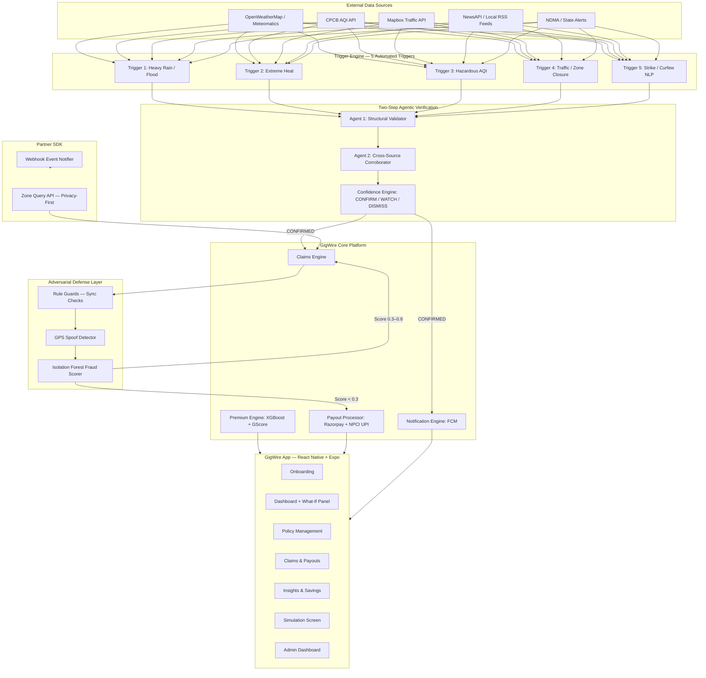
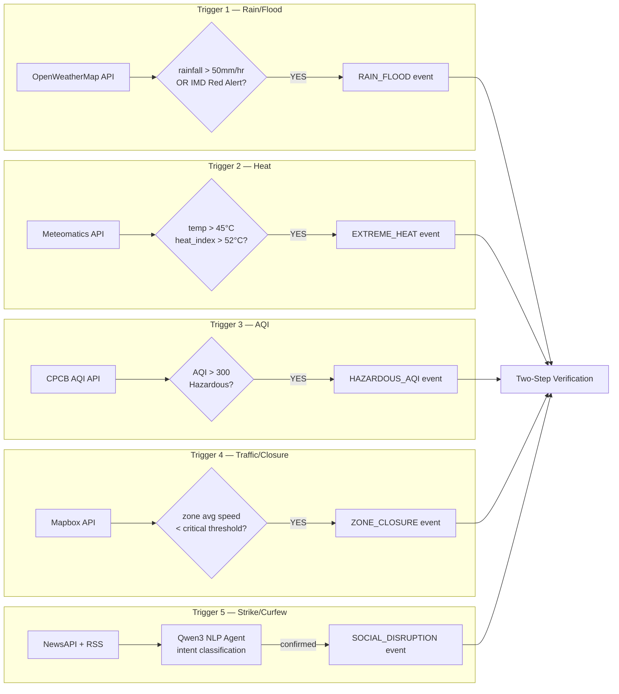
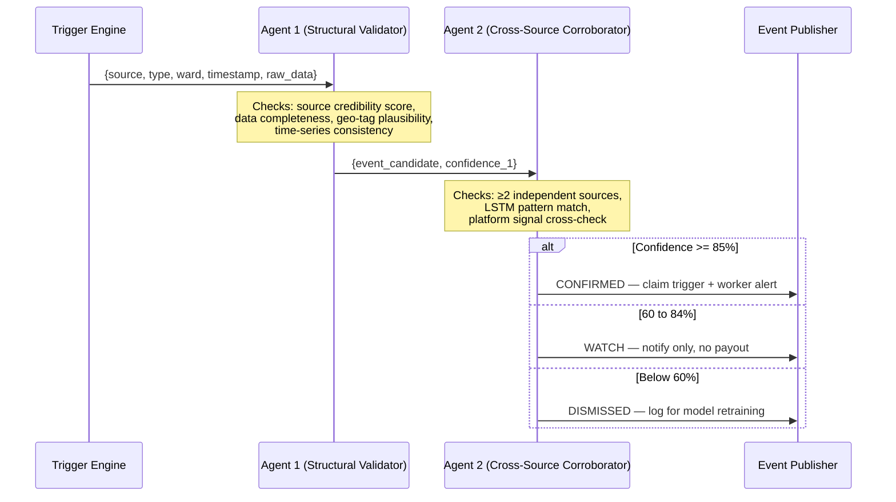
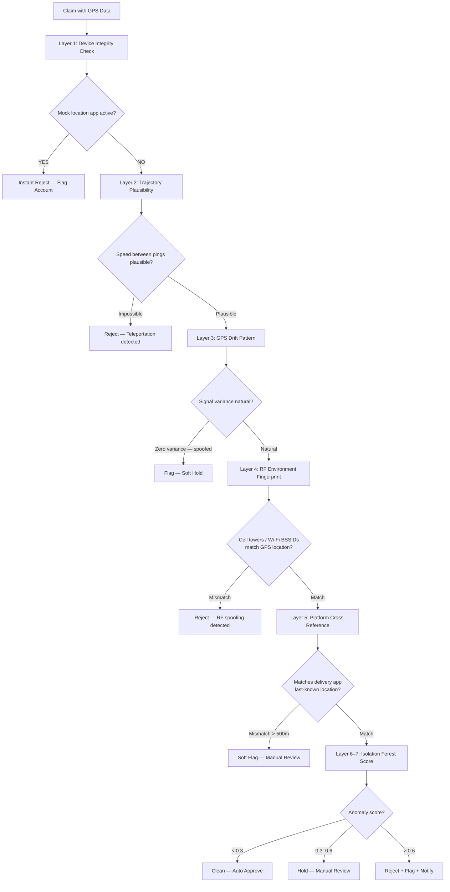
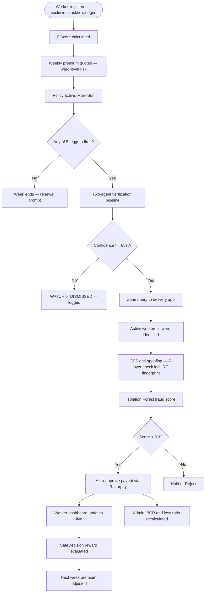

# GigWire — AI-Powered Parametric Income Insurance for India's Gig Economy

> **Guidewire DEVTrails 2026 | Unicorn Chase | Phase 2 Submission**
> _ Protecting the last-mile heroes of India's digital economy _

---

## Table of Contents

1. [Problem Statement & Market Context](#1-problem-statement--market-context)
2. [Our Solution — GigWire](#2-our-solution--gigwire)
3. [Persona Focus](#3-persona-focus)
4. [Insurance Domain — Coverage, Exclusions & Regulatory Framework](#4-insurance-domain--coverage-exclusions--regulatory-framework)
5. [Actuarial Model & Financial Sustainability](#5-actuarial-model--financial-sustainability)
6. [System Architecture](#6-system-architecture)
7. [Core Modules & Algorithms](#7-core-modules--algorithms)
   - 7.1 [GScore — Worker Risk Profiling](#71-gscore--worker-risk-profiling)
   - 7.2 [Dynamic Premium Calculation](#72-dynamic-premium-calculation)
   - 7.3 [Disruption Detection Pipeline & Automated Triggers](#73-disruption-detection-pipeline--automated-triggers)
   - 7.4 [Two-Step Event Verification (Agentic AI)](#74-two-step-event-verification-agentic-ai)
   - 7.5 [Parametric Claim Engine](#75-parametric-claim-engine)
   - 7.6 [Fraud Detection System](#76-fraud-detection-system)
8. [Adversarial Defense & Anti-Spoofing Strategy](#8-adversarial-defense--anti-spoofing-strategy)
9. [Basis Risk Mitigation — Ward-Level Data Architecture](#9-basis-risk-mitigation--ward-level-data-architecture)
10. [Key Innovation: Privacy-First API Integration](#10-key-innovation-privacy-first-api-integration)
11. [Predictive Alert & Reward System](#11-predictive-alert--reward-system)
12. [Application Screens](#12-application-screens)
13. [Admin Dashboard — Insurer Web Portal](#13-admin-dashboard--insurer-web-portal)
14. [Simulation Screen — Live Verification Demo](#14-simulation-screen--live-verification-demo)
15. [Tech Stack](#15-tech-stack)
15. [Platform Strategy — Mobile App + Embedded SDK](#16-platform-strategy--mobile-app--embedded-sdk)
16. [Weekly Pricing Model](#17-weekly-pricing-model)
17. [Data Flow Diagrams](#18-data-flow-diagrams)
18. [Research References](#19-research-references)

---

## 1. Problem Statement & Market Context

### The Protection Gap

India's platform-based delivery partners — working for Zomato, Swiggy, Zepto, Amazon,
Dunzo, and Blinkit — are among the fastest-growing and most financially precarious segments
of the Indian workforce. According to NITI Aayog, the gig workforce grew by approximately
55% over a recent four-year period, reaching roughly **12 million platform workers** by
2024–2025, accounting for over 2% of the entire Indian workforce. Projections estimate this
will reach **23.5 million by 2030**. Delivery partners across food delivery and quick
commerce platforms alone process over 10 million daily orders.

Despite this scale, these workers operate entirely outside traditional social security systems
as independent contractors — with zero income protection against external disruptions.

### The Financial Reality (2026 Data)

| Platform Segment | Gross Monthly Income | Net After Expenses | Payout Cycle |
|---|---|---|---|
| Food Delivery (Zomato / Swiggy) | ₹26,500–₹27,700 | ~₹21,000 | Weekly |
| Quick Commerce (Zepto / Blinkit) | ₹25,000–₹35,000 | ~₹18,000–₹26,000 | Weekly |
| E-commerce (Amazon / Flipkart) | ₹20,000–₹30,000 | ~₹15,000–₹22,000 | Varies |

Approximately **20–32% of gross income** is consumed by fuel, vehicle maintenance, mobile
data, and asset insurance — leaving narrow net margins that are acutely vulnerable to
disruption. External events such as extreme weather, severe air pollution, and localized
unrest cause a **20–30% reduction in monthly earnings** for delivery partners.

Critically, missing a peak earning window — typically between 7 PM and 10 PM — does not
merely cost that window's wages. Platform algorithms prioritize consistent, active workers,
so a missed peak window also causes a worker to miss daily and weekly incentive targets
and negatively impacts future priority order allocation. The income loss is non-linear.

### Why Existing Parametric Products Have Failed

India has seen several parametric insurance pilots — SEWA/ICICI Lombard for extreme heat,
Digit Insurance for AQI-based construction worker coverage, Bajaj Allianz for multi-peril
climate triggers (2025). These programs have stalled in a pre-scaling loop due to:

- **Basis risk** — coarse city-level data failing to reflect on-ground conditions (the Tata
  AIG/Nagaland program failed to pay a single claim during actual floods because thresholds
  relied on satellite data instead of ward-level readings)
- **Affordability** — premium costs negating already narrow profit margins
- **No social disruption coverage** — weather APIs cannot detect strikes, curfews, or
  market closures

GigWire is designed to directly address each of these failures.

**External disruptions covered by GigWire:**

| Disruption Type | Examples | Worker Impact |
|---|---|---|
| Environmental | Heavy rain (>50mm/hr), Floods, Extreme heat (>45°C), AQI >300 | Cannot work outdoors / Deliveries halted |
| Social | Unplanned curfews, Local strikes, Sudden market/zone closures | Unable to access pickup/drop locations |

---

## 2. Our Solution — GigWire

**GigWire** is a lightweight, AI-powered parametric income insurance platform that:

- **Detects** disruption events automatically using 5 automated triggers across weather, AQI, traffic, and news APIs — at ward level, not city level
- **Verifies** every event through a mandatory two-stage agentic AI pipeline before any payout is triggered
- **Guards** against GPS spoofing, fake location claims, and coordinated fraud using a multi-layer adversarial defense system
- **Calculates** payout based on the worker's actual lost hours and declared income
- **Pays** instantly via simulated UPI/Razorpay within minutes of event confirmation
- **Rewards** workers who act on predictive disruption alerts with premium discounts

---

## 3. Persona Focus

**Primary Persona: Food Delivery Partners — Zomato & Swiggy**
- Work 6–14 hours/day on two-wheelers, earn ₹600–₹1,200/day (net ~₹21,000/month)
- Own low-end Android phones (2GB RAM, Android 8+), operate in 2G/3G areas
- Skeptical of insurance — need rupee-value ROI shown plainly, not policy jargon
- Speak Hindi or regional languages primarily
- Financially exposed during peak hours (7–10 PM) when algorithmic incentives compound loss

---

## 4. Insurance Domain — Coverage, Exclusions & Regulatory Framework

GigWire is a **parametric micro-insurance product** designed in accordance with IRDAI
regulations for micro-segment insurance products targeting unorganised workers.

### What Is Covered

Coverage is strictly limited to **verifiable income loss** caused by external disruptions
that prevent a delivery worker from working. A payout is triggered only when all three
conditions are met:

1. A qualifying disruption event is detected and verified at ward level in the worker's active zone
2. The worker was confirmed as active (online and in-zone) during the disruption window
3. The claim passes all fraud and anti-spoofing checks

| Covered Event | Parametric Trigger Threshold |
|---|---|
| Heavy Rain / Flood | Rainfall > 50mm/hr OR IMD Red Alert active in zone |
| Extreme Heat | Temperature > 45°C AND Heat Index > 52°C |
| Severe Air Pollution | AQI > 300 (Hazardous, CPCB classification) |
| Unplanned Curfew | NLP-confirmed government curfew order for zone |
| Local Strike / Bandh | NLP-confirmed + corroborated across ≥2 independent news sources |
| Market / Zone Closure | Traffic velocity drop below threshold + zone-specific NLP signal |

### Standard Exclusions — Explicitly Enforced in Policy UI

Every GigWire policy displays these exclusions on the Policy Details screen. The worker
must acknowledge them during onboarding before coverage activates.

| Exclusion Category | Specific Exclusions |
|---|---|
| **Health & Medical** | Illness, hospitalisation, COVID-19, personal injury during work |
| **Life & Disability** | Death benefit, permanent disability, critical illness |
| **Accident & Liability** | Road accidents, third-party liability, collision damage |
| **Vehicle & Equipment** | Bike repair, fuel costs, tyre replacement, mobile damage |
| **Intentional Acts** | Self-caused disruptions, deliberate avoidance of work |
| **Pre-existing Conditions** | Known scheduled strikes, pre-announced events, planned maintenance |
| **Income Beyond Cap** | Any loss exceeding 5× the weekly premium paid |
| **Non-active Workers** | Workers who were offline or outside the disruption zone |

> **Policy Principle:** GigWire insures _ income lost during an uncontrollable external
> disruption _ only. It does not insure the worker's health, vehicle, or any recovery cost.
> The claim engine is structurally incapable of generating payouts for excluded categories.

### Regulatory Framework

**IRDAI Compliance:** GigWire is designed under the IRDAI Insurance Products Regulations,
which require all insurance products to be simple to understand, transparent in exclusions,
and actuarially justified. As a micro-insurance product for unorganised workers with low
premium rates, GigWire adheres to IRDAI's micro-insurance regulations.

**IRDAI Sandbox Framework (2019):** GigWire's operational pathway is the IRDAI Regulatory
Sandbox, which allows InsurTech platforms to test automated parametric models on live
populations without completing full product approval cycles. This framework was explicitly
created to enable hyper-local, worker-focused parametric products.

**Sabka Bima Sabki Raksha Act (2025):** The landmark legislation passed in late 2025
amending the Insurance Act of 1938 explicitly identifies gig workers and informal sector
participants as underinsured segments and promotes parametric and micro-insurance as a
national priority. The act also authorised a dedicated Policyholders' Education and
Protection Fund. GigWire operates at the exact intersection this legislation was designed
to address.

### Weekly Pricing Mandate

All premiums are structured on a **weekly basis only** — aligned with the payout cycle
of a gig worker. No monthly, quarterly, or annual premium options exist in the system.

---

## 5. Actuarial Model & Financial Sustainability

### Burning Cost Rate (BCR)

For GigWire to operate sustainably without reserve drainage, insurance operations are
modelled on continuous monitoring of the **Burning Cost Rate**:

```
BCR = Total Claims Paid / Total Premiums Collected
```

Target BCR for a sustainable parametric model: **0.55 to 0.70** — meaning approximately
65 paise of every rupee collected goes toward payouts, with the remainder covering
operations and profit margins.

If the aggregate loss ratio across any specific zone pool exceeds 85%, actuarial guidelines
mandate the suspension of new enrollments for that pool to prevent reserve drainage.

### Actuarial Premium Formula

The academically grounded premium formula from parametric insurance literature:

```
Premium = (Trigger Probability) × (Average Income Lost Per Day)
```

This is the base actuarial calculation. GigWire extends this with zone-specific,
worker-specific, and seasonal modifiers (see Section 7.2) to produce a hyper-local
weekly premium that reflects actual on-ground risk rather than city-level averages.

### Stress Testing

To withstand prolonged climate events, the premium model is stress-tested against at
least one severe scenario — specifically a continuous 14-day monsoon period — ensuring
adequate reserve capital to cover peak liability across all active zone pools simultaneously.

### Reinsurance Consideration

To protect against extreme volatility from high-frequency events, the GigWire model is
structured to support reinsurance layering in production — transferring excess liability
to reinsurers above defined thresholds. This eliminates binary cliff effects where minor
fluctuations flip a payout between 100% and 0%, ensuring capital efficiency and
liquidity precisely when workers need it most.

---

## 6. System Architecture

### 6.1 High-Level Architecture



### 6.2 Phase 2 Changes from Phase 1

| Component | Phase 1 | Phase 2 |
|---|---|---|
| Trigger count | Conceptual | 5 fully implemented automated triggers |
| Verification | Designed | Live two-step agentic pipeline with confidence tiers |
| Fraud detection | Isolation Forest spec | Isolation Forest + GPS spoof detector fully implemented |
| Anti-spoofing | Not present | Full adversarial defense layer including RF fingerprinting |
| Data granularity | City-level | Ward-level / pincode-level (basis risk mitigation) |
| Actuarial model | Basic formula | BCR tracking + stress-tested premium model |
| Simulation | Not present | Interactive simulation screen with live algorithm logs |
| Home screen | Static | Dynamically updates when any trigger fires |
| Policy screen | Basic | Explicit exclusions list, IRDAI-aligned, weekly pricing enforced |
| Regulatory | Not addressed | IRDAI Sandbox + Sabka Bima Sabki Raksha Act alignment |

---

## 7. Core Modules & Algorithms

### 7.1 GScore — Worker Risk Profiling

The **GScore** is a composite worker performance metric used for premium adjustment
and fraud credibility scoring. It ensures experienced, resilient workers pay lower
premiums and that claims from low-GScore workers receive closer scrutiny.

> **Reference:** Gohil, J. & Jha, A. (2024). _ Addressing Policy Gaps for Gig Workers
> in India. _ IJFMR, Vol. 6, Issue 6. E-ISSN: 2582-2160. Section 4.2.

**Formula (weights are fixed per the reference — do not modify):**

```
GScore = (0.15 × Time) + (0.20 × Orders) + (0.15 × BeforeTime)
       + (0.15 × BadWeather) + (0.20 × Distance) + (0.15 × TimeOfDay)
```

All parameters normalised to [0, 1].

| Parameter | Weight | Description |
|---|---|---|
| Time | 0.15 | Delivery time efficiency |
| Orders | 0.20 | Daily order volume |
| BeforeTime | 0.15 | On-time delivery rate |
| BadWeather | 0.15 | Orders completed in adverse conditions |
| Distance | 0.20 | Average distance per delivery |
| TimeOfDay | 0.15 | Deliveries during challenging hours (late night / early morning) |

| GScore Range | Worker Tier | Premium Modifier |
|---|---|---|
| 0.75–1.00 | Elite | −15% |
| 0.50–0.74 | Reliable | −5% |
| 0.30–0.49 | Standard | Base |
| 0.00–0.29 | At-Risk | +10% loading |

---

### 7.2 Dynamic Premium Calculation

**Algorithm: XGBoost (Gradient Boosting)** trained on 3-year historical disruption
data per pincode, with monthly online learning updates. All data inputs are resolved at
ward / pincode level — never city-level averages.

**GigWire premium formula (extended from actuarial base):**

```
Weekly Premium = Base_Premium × Zone_Risk_Multiplier × Season_Factor × GScore_Modifier
```

```
Zone_Risk_Multiplier = normalize(
    0.40 × weather_risk_score(ward, week)
  + 0.25 × flood_zone_index(pincode)
  + 0.20 × pollution_index_7day_avg(ward)
  + 0.15 × strike_history_score(zone, month)
)

Season_Factor = historical_disruption_freq(zone, month) / annual_avg
GScore_Modifier = 1 - ((GScore - 0.5) × 0.3)   // range: 0.85–1.15
```

**Worked example — Chennai, December, reliable worker:**

```
Base: ₹35
Zone_Risk: 1.45  (cyclone-prone coastal ward)
Season:    1.60  (December = 3× annual average)
GScore:    0.88  (Reliable tier)
Premium  = ₹35 × 1.45 × 1.60 × 0.88 ≈ ₹71/week
```

**Live data inputs (Phase 2 integrations):**
- OpenWeatherMap + Meteomatics → ward-level weather risk
- CPCB AQI API → ward-level pollution index
- Mapbox → flood-prone zone tagging, traffic density
- Historical pincode data → waterlogging frequency, strike history

---

### 7.3 Disruption Detection Pipeline & Automated Triggers

Five automated triggers implemented in Phase 2 using `triggerEngine.ts` and
`triggerConfig.json`. All thresholds are evaluated at ward / pincode level.



All five triggers expose mock input controls in the Simulation Screen, allowing
any parameter value to be entered manually so the full pipeline can be demonstrated live.

---

### 7.4 Two-Step Event Verification (Agentic AI)

No single data source ever directly triggers a payout. Every event must pass through
two independent AI agents before reaching the claims engine.



**Powered by:** Qwen3 + GPT-OSS (open-source LLMs — cost-efficient and self-hostable)

---

### 7.5 Parametric Claim Engine

```
loss  = declared_hourly_income × disruption_hours
payout = min(loss, 5 × weekly_premium)
```

The claim engine (`claimProcessor.ts`) subscribes to confirmed disruption events,
queries active workers via the zone query API, runs fraud and anti-spoofing checks,
and dispatches payouts. No manual claim filing at any point.

**Zero-touch settlement pipeline:**

| Step | System Action |
|---|---|
| 1. Trigger confirmed | Ward-level threshold crossed, two-agent verification passes |
| 2. Worker eligibility | Active policy check, zone confirmation, no duplicate claim |
| 3. Payout calculated | `loss = hourly_income × disruption_hours`, cap enforced |
| 4. Transfer initiated | UPI via Razorpay Sandbox; IMPS fallback if UPI unlinked |
| 5. Record updated | Claim logged, admin dashboard loss ratio recalculated |

---

### 7.6 Fraud Detection System

**Rule-Based Guards (synchronous — run first):**

| Guard | Check |
|---|---|
| Zone match | Worker's GPS must be within the disruption zone polygon |
| Activity check | Platform confirms worker was NOT completing deliveries during window |
| Duplicate check | No overlapping claims for the same time window |
| Status match | Platform online/offline status matches claimed disruption window |

**Isolation Forest (asynchronous ML layer):**

Features: claim frequency vs peer group, payout/income ratio, zone vs 30-day historical
location, device fingerprint consistency, time-of-claim pattern

| Score | Decision |
|---|---|
| < 0.3 | Auto-approve, instant payout |
| 0.3–0.6 | 24hr hold, human review queue |
| > 0.6 | Reject + flag account |

---

## 8. Adversarial Defense & Anti-Spoofing Strategy

### 8.1 The GPS Spoofing Threat Model

A fraudulent worker could attempt to:
1. **Fake location** — spoof GPS to appear in a disrupted zone while working normally elsewhere
2. **Replay a legitimate signal** — reuse a captured GPS trace from a valid disruption event
3. **Coordinate fraud** — multiple workers submitting identical GPS traces for the same event
4. **Use mock location apps** — Android developer options or third-party GPS spoofer tools

### 8.2 Detection Pipeline



### 8.3 Full Anti-Spoofing Check Table

| Check | Method | Spoofing Signal Detected |
|---|---|---|
| Mock Location Detection | Android `isMockLocationEnabled` flag | GPS spoofer app is active |
| Trajectory Velocity | Speed = distance(ping_n, ping_n+1) / time_delta | Speed > 200km/h = physically impossible |
| GPS Drift Variance | Statistical variance of consecutive coordinate pings | Spoofed signals show unnaturally zero variance |
| RF Environment Fingerprint | Cross-check GPS against local Wi-Fi BSSIDs + cell tower IDs | GPS says Koramangala but device sees Whitefield towers |
| Platform Cross-Reference | GigWire GPS vs delivery app's last-known location log | Coordinate mismatch > 500m |
| Historical Zone Affinity | Claimed zone vs 30-day historical delivery zones | First-ever claim in a high-risk zone = elevated risk score |
| Peer Cluster Detection | Multiple workers, identical GPS traces, same event window | Coordinated spoofing pattern flagged by Isolation Forest |

**RF Environment Fingerprinting** is the most robust layer. Even if a worker successfully
spoofs their GPS coordinates, their device's Wi-Fi and cellular radio environment reflects
actual physical location. A mismatch between the GPS claim and the surrounding RF
infrastructure is a near-definitive spoofing signal.

---

## 9. Basis Risk Mitigation — Ward-Level Data Architecture

**Basis risk** is the core reason parametric insurance programs fail in India — the
discrepancy between the index trigger and the actual loss on the ground. The Tata AIG
program in Nagaland failed to pay a single valid claim during actual floods because
trigger thresholds were built on coarse satellite data rather than local ground readings.

GigWire addresses this explicitly through a ward-level data architecture:

| Approach | Traditional Products | GigWire |
|---|---|---|
| Data resolution | City-level or district averages | Ward / pincode level |
| Trigger calibration | Fixed hardcoded thresholds | Recalibrated weekly per pincode against 90-day rolling baseline |
| Weather source | Satellite data or airport stations | IMD API + OpenWeatherMap at street-level resolution |
| AQI source | State-level averages | CPCB ward-level monitoring station data |
| Validation | Single source | Two-agent cross-source corroboration required |

By anchoring every trigger, premium, and payout to the worker's specific pincode and
active delivery zone, GigWire ensures that a worker who cannot work due to localised
flooding in their zone receives a payout — even if the neighbouring district registers
no disruption at all.

---

## 10. Key Innovation: Privacy-First API Integration

GigWire never receives the full worker database. When a disruption is confirmed,
GigWire sends a minimal zone query to the delivery app:

```json
POST /gigwire/active-workers
{
  "zone_polygon": [...coordinates...],
  "start_timestamp": "2025-07-15T10:00:00Z",
  "end_timestamp": "2025-07-15T14:00:00Z"
}
```

Delivery app returns only:
```json
[{ "worker_id": "anon_xyz_123", "active_since": "09:45", "declared_hourly_income": 90 }]
```

No names, phone numbers, full location history, or bank details ever leave the platform.
The delivery app retains complete data sovereignty. Payouts flow through the app's
in-app wallet — GigWire never touches worker bank details directly.

Delivered as a REST API and a lightweight embedded SDK (<200KB) that plugs into the
delivery app's existing backend with no architectural changes required.

---

## 11. Predictive Alert & Reward System

An LSTM model produces 48-hour zone-level disruption forecasts. Workers receive push
alerts via FCM when disruption probability exceeds 65%.

If a worker acts on the alert — avoids the zone or logs off — and the disruption is
later confirmed, they earn a **SafeDecision** premium discount the following week.

| Consecutive Safe Decisions | Premium Discount | Badge |
|---|---|---|
| 1 | −5% | Rain-Ready |
| 3 | −10% | Storm Shield |
| 5 | −15% | Safety Champion |
| 10 lifetime | −20% permanent | GigGuardian |

---

## 12. Application Screens

**Screen 1 — Onboarding / Registration**
Platform selection, city/pincode, daily earnings declaration, UPI setup. Displays the
full Standard Exclusions list which the worker must acknowledge before coverage activates.

**Screen 2 — Worker Dashboard**
Active policy status, premium paid, live zone disruption alert, earnings protected this
week. Includes the **What-If Panel** — two side-by-side cards showing earnings recovered
WITH GigWire vs total loss WITHOUT, populated with real disruption data from the current
week. Dynamically updates via `PayoutContext` when any of the 5 triggers fires.

**Screen 3 — Policy Management**
Weekly premium breakdown with formula shown as actual numbers. Coverage period Mon–Sun,
one-tap renewal, remaining coverage cap. Explicit standard exclusions section — each
exclusion listed with a brief explanation, IRDAI-compliant language.

**Screen 4 — Claims & Payouts**
Auto-populated event log (zero manual filing). Per-event claim card: trigger type,
hours lost, income lost, payout amount, UPI credit status. Full historical claim table.

**Screen 5 — Insights & Savings**
Total earnings protected, "lost without insurance" counter, premium vs payout ROI chart,
month-wise disruption vs payout bar chart, streak tracker, SafeDecision badges earned.

**Screen 6 — Simulation Screen**
Interactive demo tool for evaluators. See Section 13.

**Screen 7 — Admin / Insurer Dashboard**
Policy count, premiums collected, BCR / loss ratio gauge, zone-wise disruption heatmap
(Mapbox), fraud flag queue with Isolation Forest scores, LSTM next-week high-claim
zone forecast.

---

## 13. Admin Dashboard — Insurer Web Portal

The **GigWire Admin Dashboard** is a separate, standalone web application built for
insurance company administrators, underwriters, and operations teams. It provides a
real-time operational view of the entire GigWire platform — from enrollment metrics and
premium collection to fraud queues and actuarial health indicators.

### Overview

The dashboard is a **Next.js** web application that mirrors the visual language of the
GigWire worker app — using the same colour palette, typography, and design tokens —
while adapting the layout and information density for a desktop-first insurer workflow.
It features fluid animations, vibrant status indicators, and a clean, professional UI
theme appropriate for a regulated insurance operations context.

### Key Dashboard Panels

| Panel | Description |
|---|---|
| **User Metrics** | Total registered workers, new enrollments this week, worker tier breakdown (Elite / Reliable / Standard / At-Risk) |
| **Active Policies** | Live count of active policies by zone and city, policies expiring this week, renewal rate |
| **Research & Claims** | Open investigations, claims under active fraud review, Isolation Forest score distribution across pending claims |
| **Premium & BCR Health** | Total premiums collected (current week and cumulative), BCR gauge per zone pool, loss ratio trend chart |
| **Disruption Heatmap** | Mapbox-powered ward-level heatmap showing current and historical disruption events across all active zones |
| **Fraud Flag Queue** | Table of flagged claims with Isolation Forest anomaly scores, GPS spoof detection flags, and one-click review actions |
| **LSTM Forecast Panel** | Next-week high-claim zone predictions from the disruption forecasting model, with confidence bands |
| **Payout Ledger** | Chronological log of all triggered payouts — event type, zone, worker tier, payout amount, UPI status |

### Mock Data & Demo Mode

For the hackathon submission, the dashboard runs entirely on **mock data** that simulates
a realistic insurance operations environment:

- **1,240 total registered workers** across 6 cities (Bengaluru, Mumbai, Chennai, Delhi,
  Hyderabad, Pune)
- **847 currently active policies** (68% activation rate)
- **23 workers flagged** in the fraud review queue with varying Isolation Forest scores
- **Weekly BCR of 0.61** across the aggregate pool — within the 0.55–0.70 target range
- **4 zone disruption events** in the past 7 days — 3 confirmed payouts, 1 dismissed
- **LSTM forecast:** Bengaluru South and Mumbai Dharavi rated HIGH (>65% probability)
  for disruption in the next 7 days

### UI & Design

The admin dashboard is built to feel like a professional insurance SaaS product:

- **Theme:** Dark-accented sidebar with a light main canvas — matches the GigWire app's
  primary brand colours (deep teal, amber accent, white text)
- **Animations:** Smooth page transitions, animated gauge fills for BCR and loss ratio,
  live-updating counters on the metrics cards, and staggered card entrance animations
  on load
- **Vibrant indicators:** Colour-coded status badges (green = healthy, amber = watch,
  red = breach) on every metric that has a defined threshold
- **Data visualisations:** Recharts-powered bar charts, line charts, and gauge components
  for all time-series and ratio data
- **Responsive layout:** Optimised for 1440px+ desktop; gracefully degrades to tablet

### Running the Admin Dashboard

```bash
# From the project root
cd admin-dashboard
npm install
npm run dev
# Open http://localhost:3000
```

The admin portal runs independently of the main React Native / Expo app and requires
no backend connection — all data is served from mock fixtures in `/data/mockData.ts`.

---

## 14. Simulation Screen — Live Verification Demo

The Simulation Screen demonstrates the full pipeline in real time for evaluators.

**Five Interactive Trigger Scenarios**
Each trigger exposes mock input fields (e.g., rainfall in mm/hr, temperature in °C,
AQI value). Below threshold — nothing fires. Above threshold — the full pipeline
executes with live logs.

**Algorithm Inspector Log Panel**
A terminal-style view printing real-time status as each stage processes: trigger
evaluation, Agent 1 structural check, Agent 2 corroboration, confidence score outcome,
GPS anti-spoofing layers, Isolation Forest fraud score, payout calculation, UPI status.

**Under the Hood Dropdown**
Post-simulation expandable section explaining each algorithm used, why each check
exists, and what attack vector each guard prevents — written for judge-friendly review.

**GPS Spoofing Attack Demo**
A dedicated scenario simulating a fraudulent claim attempt. Shows each of the 7
anti-spoofing layers firing and demonstrates instant rejection with account flagging.

**Example clean claim log:**
```
[TRIGGER] Heavy Rain — 72mm/hr detected in Ward: Koramangala-4
[AGENT 1] Structural validation... source credibility: 0.94 PASS
[AGENT 2] Cross-source corroboration... 3 sources confirmed PASS
[CONFIDENCE] 0.91 — STATUS: CONFIRMED
[ZONE QUERY] Querying active workers in zone polygon...
[WORKER] Worker #GW-4421 — active since 09:15, Rs.90/hr declared
[GPS CHECK] Mock location flag: FALSE PASS
[GPS CHECK] Trajectory velocity: 18km/h PASS (plausible)
[GPS CHECK] Drift variance: 0.0042 PASS (natural signal)
[GPS CHECK] RF fingerprint: cell towers match GPS location PASS
[GPS CHECK] Platform cross-reference: within 120m PASS
[ISOLATION FOREST] Anomaly score: 0.14 — CLEAN
[CLAIM] Loss = Rs.90 x 4hrs = Rs.360 | Coverage cap: Rs.175 | Payout: Rs.175
[PAYOUT] UPI credit initiated via Razorpay Sandbox PASS
```

**Example blocked spoofing attempt:**
```
[GPS CHECK] Mock location flag: TRUE FAIL
[GPS CHECK] RF fingerprint: GPS says Koramangala, towers show Whitefield FAIL
[DECISION] INSTANT REJECT — GPS spoofing detected
[ACTION] Account flagged for review. Worker notified.
```

**Home Screen Sync**
When any trigger fires in the simulation, the Home Screen dashboard updates live via
`PayoutContext` — earnings protected, active alert banner, and payout history all
reflect the simulated event.

---

## 15. Tech Stack

### Application

| Layer | Technology |
|---|---|
| Mobile App | React Native + Expo (web-runnable via `npm run web`) |
| Admin Panel | Next.js |
| Offline Storage | AsyncStorage + SQLite |
| Charts | Victory Native |
| Push Notifications | Firebase Cloud Messaging (FCM) |
| Maps / Geofencing | Mapbox |

### Backend & Services

| Layer | Technology |
|---|---|
| Core API | Node.js + NestJS |
| Database | PostgreSQL + Supabase |
| Cache / Queue | Redis + Bull |
| ML Service | Python + FastAPI + scikit-learn + XGBoost |
| AI / LLM Agents | Qwen3 + GPT-OSS |
| Event Streaming | Apache Kafka |

### External APIs

| API | Purpose |
|---|---|
| OpenWeatherMap + Meteomatics | Weather triggers — rain, heat (ward-level) |
| CPCB AQI API | Air quality trigger (ward-level monitoring stations) |
| Mapbox | Zone polygon matching, traffic trigger, disruption heatmap |
| NewsAPI + Local RSS | Social disruption NLP trigger |
| NDMA / State Alerts | Government event feeds |
| Razorpay Sandbox | Simulated UPI payout processing |
| NPCI UPI API | UPI credit flow simulation |

---

## 16. Platform Strategy — Mobile App + Embedded SDK

**Channel A — GigWire App (Standalone)**
React Native + Expo, web-runnable at `http://localhost:8081`. Target: Android 8+,
<15MB APK, 2G/3G optimised, offline-first with local SQLite caching. For workers on
any delivery platform.

**Channel B — GigWire SDK (Embedded)**
Node.js npm package, <200KB. Integrates into the delivery app's existing backend —
stateless, no architectural changes required, queue-based retry for network failures.
Zone query API + webhook event notifier. Platform retains full data control.

---

## 17. Weekly Pricing Model

```
Policy Period:    Monday 00:00 to Sunday 23:59
Premium Charged:  Sunday midnight (auto-debit or one-tap renewal)
Payout Window:    Within 10 minutes of event verification
Coverage Cap:     5x weekly premium (max payout per week)
BCR Target:       0.55 to 0.70 (monitored per zone pool)
```

**Sample premiums by city and season:**

| Worker Profile | Zone Risk | Season Factor | GScore | Weekly Premium |
|---|---|---|---|---|
| Mumbai, July (monsoon), Elite | 1.60 | 1.80 | 0.85 | ~₹86 |
| Bangalore, March (dry), Standard | 1.00 | 0.80 | 0.50 | ~₹28 |
| Chennai, December (cyclone), Reliable | 1.45 | 1.60 | 0.70 | ~₹57 |
| Delhi, November (severe AQI), New worker | 1.35 | 1.40 | 0.22 | ~₹66 |

---

## 18. Data Flow Diagrams

### End-to-End Zero-Touch Claim Flow



---

## 19. Research References

1. **Gohil, J. & Jha, A. (2024).** _ Addressing Policy Gaps for Gig Workers in India:
   A Focus on Food Delivery Platforms. _ IJFMR, Vol. 6, Issue 6. E-ISSN: 2582-2160.
   — GScore formula, Section 4.2

2. **NITI Aayog (2024–2025).** Gig and Platform Workers in India — workforce size,
   growth projections, and protection gap data.

3. **Sabka Bima Sabki Raksha Act (2025).** Amendment to Insurance Act 1938 and IRDAI
   Act 1999 — gig worker coverage mandate and micro-insurance national priority
   declaration. KPMG First Notes, January 2026.

4. **IRDAI Insurance Products Regulations (2023).** Micro-insurance product guidelines,
   transparency requirements, and sandbox framework for parametric InsurTech.

5. **Parametric Insurance Literature** — Burning Cost Rate methodology, basis risk
   management, reinsurance tower design. Swiss Re Corporate Solutions; Artemis.bm;
   Wharton Impact.

6. OpenWeatherMap API — rainfall and temperature thresholds at ward level
7. CPCB — AQI classification standards (Hazardous: >300)
8. IMD — Colour-coded weather alert system (Red Alert classification)
9. NDMA — Disaster alert classification for parametric trigger design
10. Mapbox — Zone polygon geofencing and traffic velocity thresholds

---

<div align="center">

**Built for India's 12 million gig workers — and the 23.5 million more on the way.**

_ GigWire — Seed. Scale. Soar. _

</div>